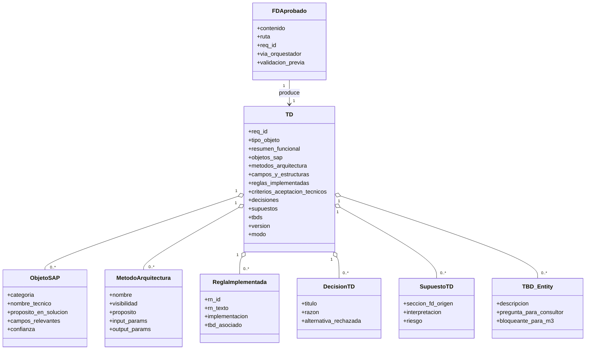

# U3 — Domain Entities: FD → TD

**Unidad**: U3
**Fecha**: 2026-05-19

Entidades conceptuales que M2 maneja. Como U2, son **conceptos** del razonamiento del sub-agente, no estructuras de datos en código.

---

## E1 — FDAprobado

**Concepto**: el input principal de M2.

| Atributo | Tipo | Descripción |
|---|---|---|
| `contenido` | markdown | Cuerpo del FD |
| `ruta` | string (opcional) | Si vino como archivo |
| `req_id` | string (opcional) | Identificador del requerimiento |
| `via_orquestador` | bool | True si M2 fue invocado por `/pipeline-abap`; False si por `/generar-td` directo |
| `validacion_previa` | enum: `con_orquestador`, `directo`, `reverse_engineering` | Influye en BR-02 (aviso) o BR-09 (modo reverse) |

---

## E2 — TipoDeObjetoABAP (enum)

**Concepto**: clasificación del objeto a construir.

| Valor | Señales típicas |
|---|---|
| `REPORTE_ALV` | "reporte", "listado", "ALV", "SALV", "exportar Excel" |
| `BADI` | "extender comportamiento estándar", referencias a códigos de transacción SAP |
| `USER_EXIT` | "modificación", "punto de extensión clásico" (CMOD) |
| `FORMULARIO` | "formulario", "SAPscript", "SmartForm", "Adobe Form" |
| `CONVERSION` | "carga masiva", "migración", "LSMW", "BAPI_*_CREATE en lote" |
| `WORKFLOW` | "flujo de aprobación", "BO", "Business Workflow" |
| `OTRO` | Si ninguna señal aplica; siempre con TBD asociado |

---

## E3 — ObjetoSAP

**Concepto**: referencia a un objeto del diccionario SAP usado en la solución.

| Atributo | Tipo | Descripción |
|---|---|---|
| `categoria` | enum: `TABLA`, `FM`, `BAPI`, `BADI`, `USER_EXIT`, `CLASE_ESTANDAR`, `ESTRUCTURA` | Tipo de objeto |
| `nombre_tecnico` | string | Ej. "MARA", "BAPI_MATERIAL_GET_DETAIL", "BADI_MATERIAL_CHECK" |
| `proposito_en_solucion` | texto | Para qué se usa en este requerimiento |
| `campos_relevantes` | lista de string (opcional) | Si es tabla/estructura, qué campos se usan |
| `confianza` | enum: `confirmado`, `verificar`, `tbd` | "confirmado" si está en estándar SAP universal; "verificar" si depende de versión/personalización; "tbd" si no se sabe |

**Restricción** (BR-14): no se aceptan `ObjetoSAP` con `nombre_tecnico` inventado. Si dudas, `confianza = tbd`.

---

## E4 — MetodoArquitectura

**Concepto**: método dentro de la clase principal del TD.

| Atributo | Tipo | Descripción |
|---|---|---|
| `nombre` | string | Ej. "select_data", "process_data", "display_alv" |
| `visibilidad` | enum: `public`, `protected`, `private` | Visibilidad ABAP |
| `proposito` | texto | 1 frase explicando qué hace |
| `input_params` | lista | Parámetros `i_<nombre>: <tipo>` |
| `output_params` | lista | Parámetros `e_<nombre>: <tipo>` o `returning` |

---

## E5 — ReglaImplementada

**Concepto**: mapping de una `RN<n>` del FD a su implementación en el TD.

| Atributo | Tipo | Descripción |
|---|---|---|
| `rn_id` | string | "RN1", "RN2", ... (eco del FD) |
| `rn_texto` | texto | Texto literal de la regla en el FD |
| `implementacion` | texto | Cómo se implementa (qué método, qué condición, qué acción) |
| `tbd_asociado` | bool | True si la RN no pudo mapearse a una implementación concreta |

---

## E6 — DecisionTD

**Concepto**: una decisión interpretativa del sub-agente.

| Atributo | Tipo | Descripción |
|---|---|---|
| `titulo` | string corto | Ej. "Uso de SALV vs CL_GUI_ALV_GRID" |
| `razon` | texto | Por qué se eligió esta opción |
| `alternativa_rechazada` | texto (opcional) | Qué se descartó y por qué |

---

## E7 — SupuestoTD

**Concepto**: una suposición que el sub-agente hizo sobre el FD.

| Atributo | Tipo | Descripción |
|---|---|---|
| `seccion_fd_origen` | string | Sección del FD donde está el elemento ambiguo |
| `interpretacion` | texto | Qué se asumió |
| `riesgo` | enum: `bajo`, `medio`, `alto` | Si la asunción está mal, qué tan grave es |

---

## E8 — TBD

**Concepto**: información no resuelta que requiere acción del consultor / desarrollador.

| Atributo | Tipo | Descripción |
|---|---|---|
| `descripcion` | texto | Qué falta |
| `pregunta_para_consultor` | texto | Pregunta específica accionable |
| `bloqueante_para_m3` | bool | True si M3 no puede generar código sin esta info |

---

## E9 — TD (Especificación Técnica)

**Concepto**: el output principal de M2.

| Atributo | Tipo | Descripción |
|---|---|---|
| `req_id` | string | Identificador del requerimiento |
| `fd_origen_ruta` | string | Ruta del FD del que se generó |
| `tipo_objeto` | TipoDeObjetoABAP | §1 |
| `resumen_funcional` | texto | §2 |
| `objetos_sap` | lista de ObjetoSAP | §3 |
| `metodos_arquitectura` | lista de MetodoArquitectura | §4 |
| `campos_y_estructuras` | texto markdown | §5 |
| `reglas_implementadas` | lista de ReglaImplementada | §6 |
| `criterios_aceptacion_tecnicos` | lista | §7 |
| `decisiones` | lista de DecisionTD | §8 |
| `supuestos` | lista de SupuestoTD | §8 |
| `tbds` | lista de TBD | §9 |
| `version` | int | 1 para original, 2 para regeneración, etc. |
| `modo` | enum: `normal`, `directo_con_aviso`, `reverse_engineering` | Tag interno |

---

## Diagrama de relaciones

---

## Invariantes

- `len(TD.decisiones) + len(TD.supuestos) >= 1` (BR-04 — §8 no vacía; si vacía, contiene la frase canónica).
- `TD.tipo_objeto ≠ null` (BR-07 — siempre declarado).
- Si `TD.modo == "directo_con_aviso"` → el output empieza con el bloque AVISO (BR-02).
- Si `TD.modo == "reverse_engineering"` → el output empieza con el bloque "Modo Reverse Engineering" (BR-09).
- Si `TD.tipo_objeto == REPORTE_ALV` → contexto del skill template-alv aplicado (BR-08).
- Si un `ObjetoSAP.confianza != "confirmado"` → debe estar reflejado en §9 TBDs o inline con `⚠️ VERIFICAR:` (BR-14).
