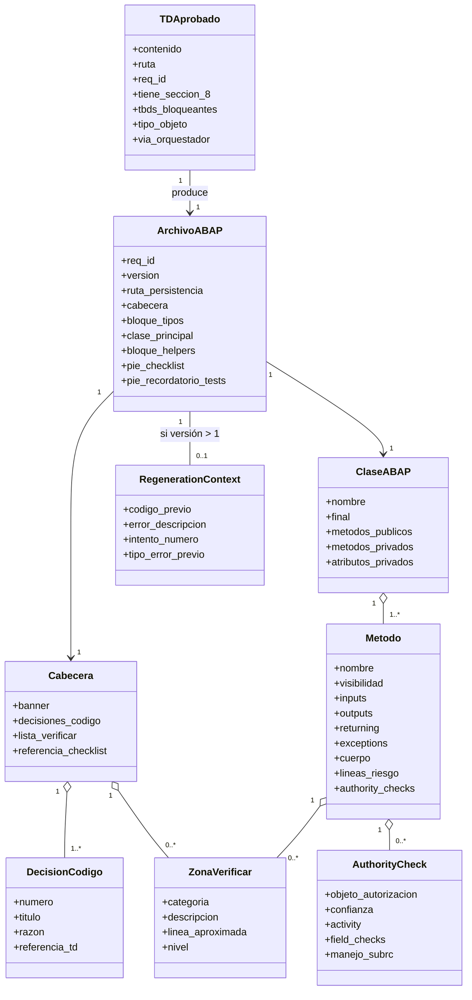

# U4 — Domain Entities: TD → Código ABAP

**Unidad**: U4
**Fecha**: 2026-05-20

---

## E1 — TDAprobado (input)

| Atributo | Tipo | Descripción |
|---|---|---|
| `contenido` | markdown | Cuerpo del TD |
| `ruta` | string | Ruta al archivo `td.md` o `td-vN.md` |
| `req_id` | string (opcional) | Identificador del requerimiento |
| `tiene_seccion_8` | bool | True si trae §8 Decisiones y Supuestos con contenido (BR-01) |
| `tbds_bloqueantes` | lista de string | Lista de TBDs §9 marcados como bloqueantes para M3 |
| `tipo_objeto` | TipoDeObjetoABAP | Extraído de §1 del TD |
| `via_orquestador` | bool | True si vino por `/pipeline-abap` (asume TD aprobado por humano post-M2); False si por `/generar-abap` directo |

---

## E2 — ArchivoABAP (output principal)

| Atributo | Tipo | Descripción |
|---|---|---|
| `req_id` | string | Eco del input |
| `version` | int | 1 inicial; +1 por cada regeneración |
| `ruta_persistencia` | string (opcional) | `outputs/<fecha>/<req-id>/codigo-vN.abap` si hay req-id |
| `cabecera` | Cabecera | §5 de business-logic-model |
| `bloque_tipos` | string | Bloque `TYPES: BEGIN OF ...` si aplica |
| `clase_principal` | ClaseABAP | DEFINITION + IMPLEMENTATION |
| `bloque_helpers` | string (opcional) | Clases auxiliares si las hay |
| `pie_checklist` | string | Bloque de cierre con referencia al checklist + responsabilidad del desarrollador |
| `pie_recordatorio_tests` | string | Recordatorio canónico de pruebas pendientes (BR-13) |

---

## E3 — Cabecera (4 bloques — Q5:A / BR-02)

| Atributo | Tipo | Descripción |
|---|---|---|
| `banner` | string | Bloque 1: generado-por-IA + req-id + fechas + versión |
| `decisiones_codigo` | lista de string | Bloque 2: decisiones técnicas numeradas |
| `lista_verificar` | lista de string | Bloque 3: referencias a zonas `⚠️ VERIFICAR:` con número de línea aproximado |
| `referencia_checklist` | string | Bloque 4: referencia obligatoria al checklist de auditoría |

---

## E4 — ClaseABAP

| Atributo | Tipo | Descripción |
|---|---|---|
| `nombre` | string | `ZCL_<dominio>_<proposito>` |
| `final` | bool | Por defecto True |
| `metodos_publicos` | lista de Metodo | Interface pública |
| `metodos_privados` | lista de Metodo | Helpers internos |
| `atributos_privados` | lista de Atributo | Estado de la clase |

---

## E5 — Metodo

| Atributo | Tipo | Descripción |
|---|---|---|
| `nombre` | string | `constructor`, `select_data`, `process_data`, etc. |
| `visibilidad` | enum: `PUBLIC`, `PROTECTED`, `PRIVATE` | |
| `inputs` | lista de Parametro | `iv_`/`it_`/`is_` parameters |
| `outputs` | lista de Parametro | `ev_`/`et_`/`es_` parameters |
| `returning` | Parametro (opcional) | Si es función pura |
| `exceptions` | lista de string | Clases `CX_*` que lanza |
| `cuerpo` | string | Código ABAP del método |
| `lineas_riesgo` | lista de ZonaVerificar | Sub-bloques marcados con `⚠️ VERIFICAR:` |
| `authority_checks` | lista de AuthorityCheck | Bloques de control de autorización |

---

## E6 — ZonaVerificar (`⚠️ VERIFICAR:`)

| Atributo | Tipo | Descripción |
|---|---|---|
| `categoria` | enum: `AUTORIZACION`, `TABLA_Z`, `CONDICION_BORDE`, `FM_NO_ESTANDAR`, `LOGICA_TRANSFORMACION` | Tipo de riesgo (§4 de business-logic-model) |
| `descripcion` | string | Texto del comentario en el código |
| `linea_aproximada` | int | Número de línea para referencia en cabecera |
| `nivel` | enum: `LINEA`, `BLOQUE` | Granularidad |

---

## E7 — AuthorityCheck

| Atributo | Tipo | Descripción |
|---|---|---|
| `objeto_autorizacion` | string | Ej. `'Z_NOMINA'`, `'S_TABU_DIS'` |
| `confianza` | enum: `confirmado_en_td`, `inferido_marcar_verificar` | Si inferido, viene con `⚠️ VERIFICAR:` |
| `activity` | string | Ej. `'03'` (display), `'01'` (create) |
| `field_checks` | lista | Pares `ID 'X' FIELD '...'` |
| `manejo_subrc` | string | Código que sigue al check (usualmente `IF sy-subrc <> 0. RAISE EXCEPTION ...`) |

---

## E8 — DecisionCodigo

| Atributo | Tipo | Descripción |
|---|---|---|
| `numero` | int | 1, 2, 3... |
| `titulo` | string corto | Ej. "Uso de CL_SALV_TABLE en lugar de CL_GUI_ALV_GRID" |
| `razon` | string | Por qué se eligió esa opción |
| `referencia_td` | string (opcional) | Si la decisión se origina en §8 del TD, citarla |

---

## E9 — RegenerationContext (para FR-M3-08)

| Atributo | Tipo | Descripción |
|---|---|---|
| `codigo_previo` | ArchivoABAP | Versión anterior |
| `error_descripcion` | string | Lo que reportó el desarrollador |
| `intento_numero` | int | 1er ciclo, 2do ciclo... |
| `tipo_error_previo` | string (opcional) | Si es el mismo tipo de error que el ciclo anterior, BR-12 activa escalamiento |

---

## E10 — Validaciones pre-output (SECURITY-03/09/10)

| Validación | Cuando se aplica | Acción si falla |
|---|---|---|
| Sin `SELECT *` | Después de cada SELECT generado | Reescribir con campos explícitos |
| `FOR ALL ENTRIES` con guarda | Cada `FOR ALL ENTRIES` | Insertar `IF lt_x IS NOT INITIAL` |
| Sin SQL dinámico inseguro | Buscar concatenaciones de strings antes de `WHERE` | Reescribir con SQL estático |
| `AUTHORITY-CHECK` en datos sensibles | El TD declaró sensibilidad | Insertar AUTHORITY-CHECK + `IF sy-subrc <> 0` |
| Sin literales tipo PII | Escaneo de strings hardcoded | Reemplazar por placeholder + registrar en cabecera |
| Sin nombres reales en comentarios | Escaneo de comentarios | Reemplazar por placeholder genérico |

---

## Diagrama de relaciones

---

## Invariantes

- `ArchivoABAP.cabecera.referencia_checklist != null` (BR-02, BR-09).
- `ArchivoABAP.pie_checklist != null` (BR-09).
- `ArchivoABAP.pie_recordatorio_tests != null` (BR-13).
- Cada `Metodo.authority_checks` debe estar precedido por `⚠️ VERIFICAR:` si `confianza == "inferido_marcar_verificar"`.
- Cada `Metodo.cuerpo` que tenga `SELECT` debe pasar las validaciones E10.
- Si `RegenerationContext.intento_numero == 3` y `tipo_error_previo == tipo_error_actual` → no se genera `ArchivoABAP`, se emite escalamiento (BR-12).
- Si `TDAprobado.tiene_seccion_8 == false` → no se produce `ArchivoABAP`; se emite mensaje de rechazo (BR-01).
