# Application Design — Consolidado

**Fecha**: 2026-05-19
**Versión**: 1.0
**Insumos**: PRD §9, `requirements.md`, `application-design-plan.md` (Q1:A, Q2:C, Q3:C, Q4:C, Q5:A)
**Documentos detalle**: `components.md`, `component-methods.md`, `services.md`, `component-dependency.md`

---

## 1. Resumen ejecutivo

El producto se compone de **11 componentes** organizados en **3 capas** dentro del repositorio:

- **Capa de contexto y configuración** (4 archivos planos en raíz): CLAUDE.md, settings.json, formato-fd-generico.md, checklist-auditoria-codigo-ia.md, plan-evaluacion.md, README.md.
- **Capa de agentes y comandos** (7 archivos en `.claude/`): 3 sub-agentes (validador-fd, fd-a-td, td-a-codigo), 4 slash commands (3 atajos + 1 orquestador), 1 skill (template-alv).
- **Capa de outputs** (generada en runtime): `outputs/<fecha>-<requerimiento_id>/` con TD, código, validación y decisiones por requerimiento.

---

## 2. Arquitectura visual

```mermaid
flowchart TB
    subgraph WORKSPACE["📂 Workspace Claude Code"]
        subgraph CFG["🟡 Capa 1 — Contexto y Configuración"]
            C1["📄 CLAUDE.md"]
            C11["⚙️ settings.json"]
            C7["📋 formato-fd-generico.md"]
            C8["✅ checklist-auditoria-codigo-ia.md"]
            C9["📊 plan-evaluacion.md"]
            C10["📘 README.md"]
        end

        subgraph AGENTES["🟢 Capa 2 — Agentes, comandos y skills"]
            C2["🛡️ validador-fd"]
            C3["🔄 fd-a-td"]
            C4["⚡ td-a-codigo"]
            C5["🎼 /pipeline-abap (orquestador)"]
            CMD["⌨️ /validar-fd · /generar-td · /generar-abap (atajos)"]
            C6["🧩 Skill template-alv"]
        end

        subgraph OUT["🔵 Capa 3 — Outputs por requerimiento"]
            D1["outputs/&lt;fecha&gt;-&lt;id&gt;/"]
        end
    end

    CFG -.contexto.-> AGENTES
    AGENTES -->|persiste| OUT

    style CFG fill:#FFF59D,stroke:#F57F17,stroke-width:2px,color:#000
    style AGENTES fill:#C8E6C9,stroke:#2E7D32,stroke-width:2px,color:#000
    style OUT fill:#BBDEFB,stroke:#1565C0,stroke-width:2px,color:#000
```

---

## 3. Decisiones de diseño consolidadas

| ID | Decisión | Fuente | Implicación |
|---|---|---|---|
| AD1 | Orquestador `/pipeline-abap` invoca sub-agentes con la tool `Agent` | Q1:A | El orquestador es activo; gates humanos en chat entre invocaciones. |
| AD2 | TD se persiste como archivo Y se imprime inline | Q2:C | Trazabilidad + revisión inmediata. |
| AD3 | Settings.json permisivo; restricciones operativas en CLAUDE.md | Q3:C | Mayor flexibilidad operativa; CLAUDE.md debe ser explícito sobre prohibiciones. |
| AD4 | Template ALV como Skill activable (no embebido) | Q4:C | Extensible a otros tipos de objeto sin tocar los sub-agentes. |
| AD5 | Outputs persistidos en `outputs/<fecha>-<requerimiento_id>/` | Q5:A | Trazabilidad histórica por requerimiento. |

---

## 4. Cumplimiento de Principios No Negociables del PRD

| Principio | Cómo se materializa en el diseño |
|---|---|
| P1 — Desarrollador es garante final | C5 (orquestador) tiene 3 gates humanos obligatorios; salida final es `.abap` para importación manual. |
| P2 — FD sin calidad no avanza | C2 retorna binario; C5 detiene pipeline si RECHAZADO; C3 verifica cabecera de aprobación (FR-M2-01). |
| P3 — Agente opera sólo en desarrollo | Sin conexión a SAP; outputs son archivos en el repo. C1 documenta esta prohibición (compensa Q3:C). |
| P4 — Compuertas de QA se conservan | C8 (checklist) referenciado al pie de cada output de C4; las pruebas unitarias y funcionales no se reducen. |
| P5 — Trazabilidad total | "Decisiones y Supuestos" en C3; "Decisiones del código" + `⚠️ VERIFICAR:` en C4. Persistidos en `outputs/`. |
| P6 — IA sugiere, humano ejecuta | C5 pausa entre cada módulo; no existe modo autopilot. |

---

## 5. Cumplimiento de Security Baseline (extensión activa)

| Regla | Aplicabilidad al diseño | Cumplimiento |
|---|---|---|
| SECURITY-01 (encriptación) | N/A — sin data stores. | N/A documentado. |
| SECURITY-02 (access logging en intermediarios de red) | N/A — sin red. | N/A documentado. |
| SECURITY-03 (logging aplicacional, sin PII) | Aplica — outputs del agente son "logs operativos". | C4 prohíbe PII en código (FR-M3-11); CLAUDE.md repite la regla. |
| SECURITY-04 (headers HTTP) | N/A — sin endpoints. | N/A documentado. |
| SECURITY-09 (SQL injection) | Aplica — código ABAP generado. | C4 prohíbe SELECT * y SQL dinámico inseguro (FR-M3-10, FR-M4-09). |
| SECURITY-10 (AUTHORITY-CHECK) | Aplica — código ABAP generado. | C4 inserta AUTHORITY-CHECK en datos sensibles (FR-M3-05, FR-M4-10). |

> **Compliance summary**: la mayoría de reglas son N/A porque este producto es configuración de agente Claude Code, no aplicación desplegada. Las reglas relevantes (03, 09, 10) están materializadas en los requirements y se honran en los componentes.

---

## 6. Mapa requirements ↔ componentes

| Requirement ID | Componente | Cómo se cumple |
|---|---|---|
| IS1, IS14, IS15 | C1, C11, C10 | Archivos creados en Code Generation |
| IS2, IS5 | C2 + slash command `/validar-fd` | Sub-agente con prompt validador |
| IS3, IS6 | C3 + slash command `/generar-td` | Sub-agente con prompt FD→TD |
| IS4, IS7 | C4 + slash command `/generar-abap` | Sub-agente con prompt TD→Código |
| IS8 | C5 | Slash command orquestador con tool Agent |
| IS9 | C7 | Plantilla genérica de FD |
| IS10 | C1 | Buenas prácticas embebidas en CLAUDE.md |
| IS11 | C6 | Skill activable para reporte ALV (decisión AD4 — modificó IS11 que lo describía como embebido) |
| IS12 | C8 | Checklist independiente |
| IS13 | C9 | Diseño del plan de evaluación |
| FR-OR-01..03 | C5 | Orquestación con gates |
| FR-M1-01..08 | C2 | Validador |
| FR-M2-01..10 | C3 | FD→TD |
| FR-M3-01..12 | C4 | TD→Código |
| FR-M4-01..14 | C1 | CLAUDE.md |
| FR-DOC-01..04 | C7, C8, C9, C10 | Documentos |
| NFR-01..08 | C1 (transversal) + C11 | Idioma, trazabilidad, seguridad, mantenibilidad, usabilidad |

> **Nota sobre IS11**: la decisión AD4 (skill activable) ajusta IS11 de "instrucciones especializadas para sub-agentes M2/M3" a "skill independiente activable por contexto". El efecto funcional es equivalente; cambia el *lugar* donde vive el template.

---

## 7. Trade-offs y decisiones rechazadas

| Decisión | Alternativa rechazada | Razón |
|---|---|---|
| AD1 (orquestador activo con tool Agent) | Slash command guía pasivo | Falta de continuidad — el desarrollador tendría que invocar 3 comandos manualmente. |
| AD3 (permissive settings) | Restrictivo extremo (sólo Read/Write) | El usuario priorizó flexibilidad operativa; la defensa real está en CLAUDE.md y el entorno sin credenciales SAP. **Aceptable porque el agente no tiene acceso a ambientes SAP por ausencia de credenciales, no por restricción de tools.** |
| AD4 (skill activable) | Embebido en M2/M3 | La extensibilidad futura a BAdI/formulario/conversión justifica el desacople. |
| AD5 (outputs/<fecha>-<id>/) | Outputs sueltos con timestamps | La trazabilidad por requerimiento facilita la métrica del Excel del PRD §10 (horas de ajuste, devoluciones, etc.). |

---

## 8. Próximos pasos

Application Design completo. La siguiente etapa es **Units Generation**:
- Confirmar las 5 unidades U1..U5 propuestas en `execution-plan.md`.
- Detallar criterios de aceptación por unidad.
- Definir dependencias y orden de ejecución.

Luego, **Construction phase** itera por cada unidad: Functional Design (sólo U2/U3/U4) → NFR Requirements/Design (sólo U4) → Code Generation (todas) → Build and Test al final.
