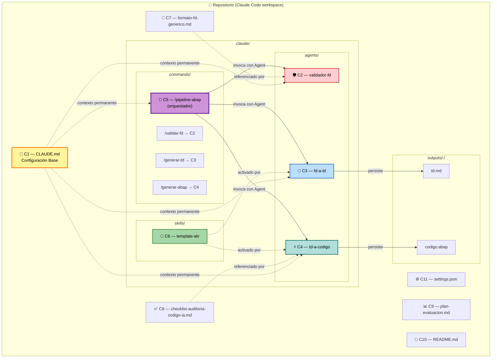

# Components — Agente IA para Desarrollo ABAP

**Fecha**: 2026-05-19
**Insumos**: `requirements.md` + `application-design-plan.md` (respuestas Q1:A, Q2:C, Q3:C, Q4:C, Q5:A) + PRD §9

---

## Inventario de componentes

| ID | Componente | Tipo Claude Code | Ubicación |
|---|---|---|---|
| C1 | Configuración Base | Memory file | `CLAUDE.md` (raíz) |
| C2 | Validador de FD (Módulo 1) | Sub-agente + Slash command | `.claude/agents/validador-fd.md` + `.claude/commands/validar-fd.md` |
| C3 | Agente FD → TD (Módulo 2) | Sub-agente + Slash command | `.claude/agents/fd-a-td.md` + `.claude/commands/generar-td.md` |
| C4 | Agente TD → Código ABAP (Módulo 3) | Sub-agente + Slash command | `.claude/agents/td-a-codigo.md` + `.claude/commands/generar-abap.md` |
| C5 | Orquestador del pipeline | Slash command (con tool `Agent`) | `.claude/commands/pipeline-abap.md` |
| C6 | Skill Template ALV | Skill activable | `.claude/skills/template-alv/SKILL.md` |
| C7 | Plantilla genérica de FD | Documento de referencia | `docs/formato-fd-generico.md` |
| C8 | Checklist de auditoría de código IA | Documento de referencia | `docs/checklist-auditoria-codigo-ia.md` |
| C9 | Plan de evaluación pre-piloto | Documento de referencia | `docs/plan-evaluacion.md` |
| C10 | README operativo | Documento de operación | `README.md` |
| C11 | Configuración de Claude Code | Settings | `.claude/settings.json` |

---

## C1 — Configuración Base (CLAUDE.md)

**Propósito**: contexto permanente del agente: rol, principios no negociables del PRD §6, restricciones operativas, convenciones, buenas prácticas SAP genéricas.

**Responsabilidades**:
- Declarar rol del agente (FR-M4-01).
- Documentar los 6 Principios No Negociables como restricciones (FR-M4-01, FR-M4-02).
- Prohibir explícitamente: escritura a SAP, transportes, ejecución en ambientes SAP, modo autopilot (FR-M4-02).
- Definir formato obligatorio "Decisiones y Supuestos" y "⚠️ VERIFICAR:" (FR-M4-03, FR-M4-04).
- Referenciar `docs/formato-fd-generico.md` como contrato de entrada del Validador (FR-M4-06).
- Embeber buenas prácticas SAP genéricas (FR-M4-05, FR-M4-09..14).
- Establecer idioma español para outputs e instrucciones (FR-M4-07, NFR-01).
- Indicar que el entregable final es `.abap` para importación manual (FR-M4-08, FR-M3-07).
- **Compensar Q3:C** (settings permissive): listar explícitamente qué tools/operaciones NO debe realizar el agente (conexiones de red a sistemas SAP, ejecución de comandos shell que toquen ambientes SAP, lectura/escritura de credenciales).

**Interfaz**:
- *Input*: ninguno (es contexto que Claude Code carga automáticamente al abrir el directorio).
- *Output*: contexto disponible para todos los sub-agentes, comandos y skills.

---

## C2 — Validador de FD (Módulo 1)

**Propósito**: compuerta de entrada del pipeline. Decide si un FD tiene calidad suficiente para alimentar el pipeline.

**Responsabilidades**:
- Analizar completitud estructural del FD contra `docs/formato-fd-generico.md` (FR-M1-01).
- Detectar ambigüedades, descripciones genéricas, faltantes (FR-M1-02).
- Producir output binario `APROBADO`/`RECHAZADO` (FR-M1-03).
- Cuando `RECHAZADO`: emitir reporte de gaps accionable (FR-M1-04).
- Cuando `APROBADO`: admite observaciones menores no bloqueantes (FR-M1-05).
- No generar TD ni código (FR-M1-06).
- No permitir bypass (FR-M1-07).
- Lenguaje no acusatorio (FR-M1-08).

**Interfaz**:
- *Input*: ruta a un archivo FD (markdown o texto), o contenido inline del FD.
- *Output*: documento estructurado con secciones: `Estado` (APROBADO/RECHAZADO), `Resumen`, `Gaps detectados` (si rechazado), `Observaciones menores` (si aprobado).

**Tipo Claude Code (decisión Q3 del PRD inicial Q3:D + reafirmado en Application Design Q1)**:
- Sub-agente `.claude/agents/validador-fd.md` para contexto largo y aislamiento.
- Slash command `.claude/commands/validar-fd.md` como atajo invocable por el usuario.

---

## C3 — Agente FD → TD (Módulo 2)

**Propósito**: traducir un FD aprobado en una Especificación Técnica (TD) razonada y trazada.

**Responsabilidades**:
- Verificar que el FD viene aprobado por C2 (FR-M2-01).
- Identificar tipo de objeto ABAP (FR-M2-02).
- Listar objetos SAP relevantes (FR-M2-03).
- Proponer arquitectura técnica del objeto (FR-M2-04).
- Especificar campos y flujo (FR-M2-05).
- Incluir sección "Decisiones y Supuestos" (FR-M2-06).
- Marcar `TBD:` lo no resuelto (FR-M2-07).
- No generar código (FR-M2-08).
- Aplicar template ALV cuando el FD es un reporte ALV → activar Skill C6 (FR-M2-09).
- Permitir regeneración con feedback (FR-M2-10).

**Interfaz**:
- *Input*: FD aprobado por C2 (markdown).
- *Output*:
  - Archivo persistido en `outputs/<fecha>-<id-requerimiento>/td.md` (decisión Q5:A + Q2:C).
  - Impresión inline del TD en el chat (decisión Q2:C).

**Tipo Claude Code**: Sub-agente + Slash command.

---

## C4 — Agente TD → Código ABAP (Módulo 3)

**Propósito**: generar código ABAP a partir de un TD aprobado.

**Responsabilidades**:
- Verificar que el TD trae sección "Decisiones y Supuestos" (FR-M3-01).
- Generar código ABAP OO con clases `ZCL_*` (FR-M3-02).
- Seguir convenciones FR-M4-09..14 (FR-M3-03).
- Marcar `⚠️ VERIFICAR:` zonas de riesgo (FR-M3-04).
- Insertar AUTHORITY-CHECK en datos sensibles (FR-M3-05, SECURITY-10).
- Incluir cabecera "Decisiones del código" (FR-M3-06).
- Entregar archivo `.abap` (FR-M3-07).
- Ciclos de retroalimentación (FR-M3-08).
- Referencia al checklist al pie (FR-M3-09, IS12).
- No SQL inseguro (FR-M3-10, SECURITY-09).
- No PII/secretos (FR-M3-11, SECURITY-03).
- Activar Skill C6 cuando el TD es para reporte ALV (FR-M3-12).

**Interfaz**:
- *Input*: TD aprobado por el desarrollador (markdown, generalmente la salida de C3).
- *Output*:
  - Archivo persistido en `outputs/<fecha>-<id-requerimiento>/codigo.abap`.
  - Impresión inline del código en el chat con sintaxis ABAP highlighted.
  - Sección al pie referenciando `docs/checklist-auditoria-codigo-ia.md`.

**Tipo Claude Code**: Sub-agente + Slash command.

---

## C5 — Orquestador `/pipeline-abap` (decisión Q1:A)

**Propósito**: ejecutar el pipeline FD→TD→Código en una sola sesión, con gates humanos entre módulos.

**Responsabilidades**:
- Invocar C2 (Validador) usando la tool `Agent` (FR-OR-01).
- Si C2 = RECHAZADO → detenerse y mostrar el reporte de gaps (FR-OR-03).
- Si C2 = APROBADO → pausa, solicita aprobación humana explícita (FR-OR-02).
- Invocar C3 (FD→TD) con el FD aprobado.
- Mostrar TD generado, persistirlo, pausa, solicita aprobación.
- Invocar C4 (TD→Código) con el TD aprobado.
- Mostrar código, persistirlo, pausa, mostrar checklist y entregar.
- Nunca avanzar sin aprobación humana en cada gate.

**Interfaz**:
- *Input*: ruta del FD a procesar y un identificador de requerimiento (para `outputs/<fecha>-<id>/`).
- *Output*: TD + `.abap` persistidos; resumen final con próximos pasos para el desarrollador (importar en Eclipse, syntax check, pruebas unitarias).

**Tipo Claude Code**: Slash command que internamente usa la tool `Agent`.

---

## C6 — Skill Template ALV (decisión Q4:C)

**Propósito**: contexto especializado para generar reportes ALV. Activable automáticamente cuando el FD/TD describe un reporte ALV.

**Responsabilidades**:
- Especificar arquitectura preferida: clase `ZCL_*` con métodos `select_data`, `process_data`, `display_alv`.
- Definir field catalog estándar y patrones de exportación.
- Indicar buenas prácticas específicas de ALV (variantes, layout, ordenamiento).
- Proporcionar ejemplos de código para los métodos clave.

**Interfaz**:
- *Activación*: automática por el modelo cuando detecta contexto de reporte ALV.
- *Consumo*: por C3 (para diseñar el TD de un ALV) y por C4 (para generar el código de un ALV).

**Tipo Claude Code**: Skill (`SKILL.md` con frontmatter `description` que dispara activación).

---

## C7 — Plantilla genérica de FD

**Propósito**: contrato de entrada del pipeline. Define qué secciones mínimas debe traer un FD para que el Validador pueda evaluarlo.

**Responsabilidades**:
- Secciones mínimas (FR-DOC-01): Objetivo, Alcance, Reglas de Negocio, Tablas SAP involucradas, Criterios de Aceptación, Casos Borde, Autorizaciones.
- Ejemplos de descripciones aceptables vs ambiguas.

**Interfaz**: documento de referencia. Consumido por C2 (validador) y por consultores funcionales.

---

## C8 — Checklist de auditoría de código IA

**Propósito**: lista de verificación para el desarrollador al revisar código generado por C4.

**Responsabilidades** (FR-DOC-02, PRD §11.3):
- Al menos 7 ítems del PRD: existencia de tablas/módulos referenciados, AUTHORITY-CHECK en datos sensibles, SELECT con campos específicos, sin SQL dinámico sin escape, condiciones borde del FD, naming, revisión explícita de `⚠️ VERIFICAR`.

**Interfaz**: documento referenciado al pie de cada output de C4.

---

## C9 — Plan de evaluación pre-piloto (sólo diseño)

**Propósito**: documento que define cómo se validaría el agente con 3–5 FDs históricos antes del piloto real.

**Responsabilidades** (FR-DOC-03, PRD §11):
- Criterios de selección del dataset.
- Proceso de comparación: TD generado vs especificación real; código generado vs código en producción.
- Métricas: compilabilidad, factualidad, completitud, adherencia a estándares, seguridad.
- Formato de reporte de hallazgos.

**Nota**: Q11:B — sólo se diseña; **no se ejecuta** en Estación 4.

---

## C10 — README operativo

**Propósito**: guía de uso para los 3 desarrolladores ABAP (FR-DOC-04, M8 PRD).

**Responsabilidades**:
- Instalación y configuración inicial (Claude Code abre el directorio).
- Cómo invocar cada slash command.
- Operacionalizar los 5 casos de uso del PRD §5 paso a paso.
- Troubleshooting básico (qué hacer si M1 rechaza, si M3 falla syntax check tras 2 ciclos, etc.).

---

## C11 — `.claude/settings.json`

**Propósito**: configuración de Claude Code para el directorio.

**Responsabilidades** (decisión Q3:C):
- Permisivo con conciencia: no restringe tools en settings.
- Mantiene el bloque `attribution` ya presente.
- Las restricciones operativas viven en C1 (CLAUDE.md).

**Nota crítica**: Q3:C es una decisión deliberada del usuario. La defensa real contra acceso a SAP es:
1. El entorno: no hay credenciales SAP en el directorio ni en el shell de Claude Code.
2. La documentación: C1 prohíbe explícitamente esas operaciones y el agente debe respetarlo.
3. La revisión humana: el desarrollador es el garante final (Principio #1 PRD).

---

## Mapa visual (componentes)

