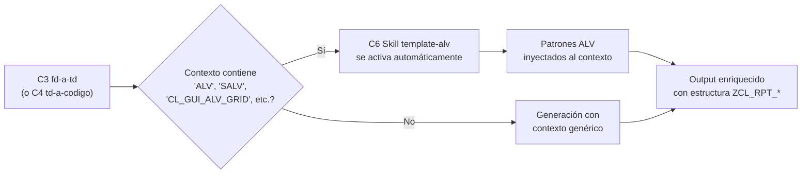

# Services — Orquestación y patrones

**Fecha**: 2026-05-19
**Nota**: en este producto, los "servicios" son **patrones de orquestación** entre componentes Claude Code, no servicios desplegables tradicionales.

---

## Servicio 1 — Pipeline orquestado (C5 `/pipeline-abap`)

**Propósito**: ejecutar la cadena C2→C3→C4 en una sola sesión con gates humanos.

**Patrón de orquestación**: `Sequential Pipeline with Human Gates`.

```mermaid
sequenceDiagram
    actor Dev as Desarrollador ABAP
    participant CMD as /pipeline-abap
    participant C2 as C2 Validador
    participant C3 as C3 FD→TD
    participant C4 as C4 TD→Código
    participant FS as outputs/&lt;fecha&gt;-&lt;id&gt;/

    Dev->>CMD: ejecuta_pipeline(fd_path, req_id)
    CMD->>C2: Agent(validador-fd, fd_path)
    C2-->>CMD: ResultadoValidacion
    CMD->>FS: persiste validacion.md
    CMD-->>Dev: muestra resultado + pregunta "¿Continuar?"

    alt RECHAZADO o Dev rechaza
        Dev-->>CMD: stop
        CMD-->>Dev: muestra gaps; pipeline detenido
    else APROBADO y Dev aprueba
        Dev->>CMD: continúa
        CMD->>C3: Agent(fd-a-td, fd_aprobado, req_id)
        C3->>FS: persiste td.md
        C3-->>CMD: TD (inline + ruta)
        CMD-->>Dev: muestra TD + pregunta "¿Continuar?"

        alt Dev pide cambios
            Dev->>CMD: feedback
            CMD->>C3: Agent(fd-a-td, regenerar, feedback)
            C3->>FS: persiste td-v2.md
        else Dev aprueba TD
            Dev->>CMD: aprobar
            CMD->>C4: Agent(td-a-codigo, td_aprobado, req_id)
            C4->>FS: persiste codigo.abap
            C4-->>CMD: codigo (inline + ruta)
            CMD-->>Dev: muestra código + referencia a C8 checklist + próximos pasos
        end
    end
```

**Características del servicio**:
- **Síncrono**: cada paso espera al anterior antes de continuar (no hay paralelización).
- **Stateful entre módulos**: el estado se materializa en archivos persistidos en `outputs/<fecha>-<id>/`.
- **Human-in-the-loop obligatorio**: 3 gates de aprobación humana (post-C2, post-C3, post-C4).
- **Sin compensación automática**: si C4 falla, no rollback automático del TD; el desarrollador decide qué hacer.
- **Error handling**: cada componente reporta su error al orquestador; el orquestador presenta al desarrollador en términos accionables.

---

## Servicio 2 — Activación contextual de skills (C6)

**Propósito**: activar contexto especializado sin que el usuario tenga que invocarlo explícitamente.

**Patrón**: `Context-Triggered Skill Activation`.



**Características**:
- **Automático**: el motor de skills de Claude Code activa el skill basándose en su `description` y el contexto actual.
- **No-bloqueante**: si el skill no se activa (FD no es ALV), el flujo continúa con el contexto base.
- **Extensible**: el patrón soporta agregar futuros skills (template-badi, template-formulario, template-conversion) sin modificar C3/C4.

---

## Servicio 3 — Invocación directa por slash command

**Propósito**: permitir al desarrollador ejecutar un módulo individual sin pasar por el orquestador (caso de uso: legacy code, retrabajos específicos).

**Patrón**: `Direct Command Invocation`.

```
/validar-fd <path-fd>        → invoca C2 sin orquestación
/generar-td <path-fd-aprobado> <req-id>  → invoca C3 directo
/generar-abap <path-td> <req-id>         → invoca C4 directo
```

**Características**:
- Útil para UC5 (objeto legado): el desarrollador puede saltar M1 si está reverse-engineering un código existente.
- Útil para depuración: si M3 falla repetidamente, el desarrollador puede invocar M3 con TD ya aprobado sin re-correr M1/M2.
- Mantiene los Principios #1, #2 y #6 igual: cada invocación directa también está sujeta a revisión humana del output.

> **Decisión registrada**: las invocaciones directas **no fuerzan** la verificación de cabecera de aprobación (FR-M2-01, FR-M3-01) si el desarrollador asume responsabilidad. El comando emite un aviso visible: `⚠️ Modo directo — no se validó cadena de aprobación. El desarrollador asume garantía de calidad del input.`

---

## Servicio 4 — Persistencia de outputs por requerimiento

**Propósito**: trazabilidad histórica por requerimiento (Q5:A).

**Patrón**: `Per-Request Filesystem Persistence`.

```
outputs/
├── 2026-05-20-REQ-2026-001/
│   ├── fd.md
│   ├── validacion.md
│   ├── td.md
│   ├── codigo.abap
│   └── decisiones.md
├── 2026-05-21-REQ-2026-002/
│   └── ...
```

**Características**:
- **Append-only por requerimiento**: regeneraciones agregan versiones (`td-v2.md`, `codigo-v2.abap`).
- **Read-only para outputs antiguos**: el agente nunca modifica un output ya cerrado; sólo crea nuevos.
- **Gobernanza git**: la carpeta `outputs/` puede o no estar en `.gitignore` (decisión operativa que el README documenta).

---

## Resumen de patrones aplicados

| Patrón | Componentes | Justificación |
|---|---|---|
| Sequential Pipeline with Human Gates | C5 ↔ C2, C3, C4 | Principios #1 y #6 del PRD: la IA sugiere, el humano ejecuta y aprueba en cada paso. |
| Context-Triggered Skill Activation | C6 activado por C3/C4 | Extensibilidad futura (templates BAdI/formulario/conversión) sin tocar los módulos. |
| Direct Command Invocation | Slash commands → C2/C3/C4 | Flexibilidad operativa para UC5 y depuración. |
| Per-Request Filesystem Persistence | `outputs/` | Trazabilidad histórica que el Excel del PRD §10 puede consumir. |
