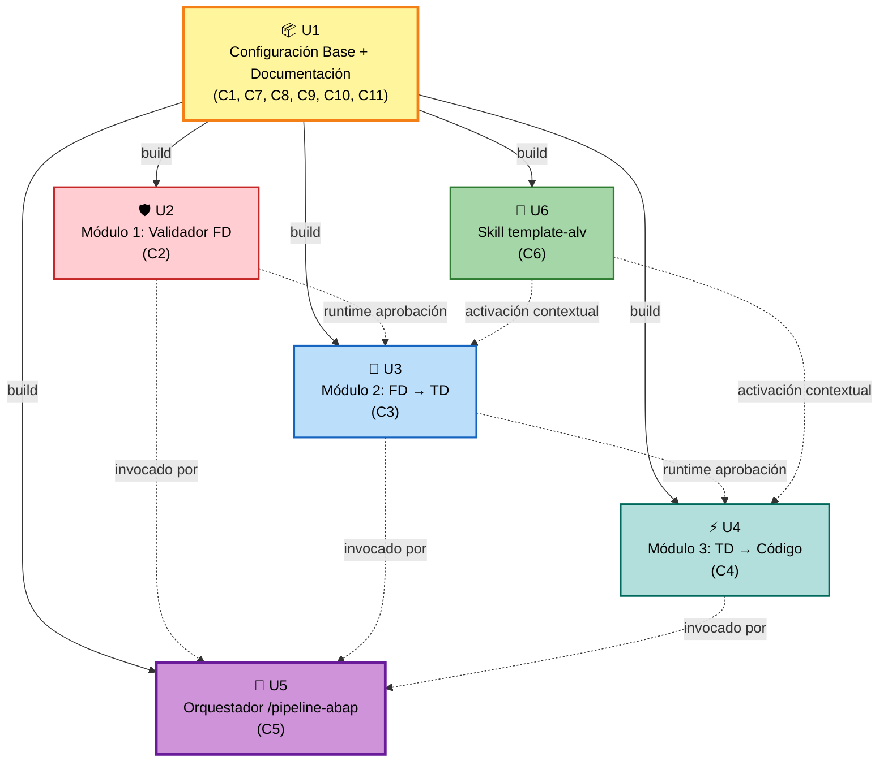

# Unit of Work Dependency — Matriz y grafo

**Fecha**: 2026-05-19

---

## Matriz de dependencias

> **Lectura**: fila `X` depende (en tiempo de build/ejecución) de columna `Y` si está marcada.

| ↓ depende de → | U1 | U2 | U3 | U4 | U5 | U6 |
|---|---|---|---|---|---|---|
| **U1** Config + Docs | — | — | — | — | — | — |
| **U2** Validador FD | ✅ build | — | — | — | — | — |
| **U3** FD→TD | ✅ build | ✅ runtime | — | — | — | ⚠️ runtime (skill) |
| **U4** TD→Código | ✅ build | — | ✅ runtime | — | — | ⚠️ runtime (skill) |
| **U5** Orquestador | ✅ build | ✅ runtime | ✅ runtime | ✅ runtime | — | — |
| **U6** Skill ALV | ✅ build | — | — | — | — | — |

**Leyenda**:
- `build`: U1 debe existir cuando se construye/escribe la unidad (sus archivos referencian a CLAUDE.md, formato-fd-generico, checklist).
- `runtime`: la dependencia se materializa cuando se ejecuta el pipeline (M2 espera FD aprobado por M1, etc.).
- `⚠️ runtime (skill)`: U3/U4 se activan con el skill C6 cuando el contexto lo amerita; no dependen del skill para existir, sólo para enriquecerse.

---

## Grafo visual

---

## Estrategia de actualización (Update Strategy)

- **Update Approach**: Sequential con paralelización opcional.
- **Critical Path**: U1 (base) → U5 (orquestador, depende de U2/U3/U4).
- **Coordination Points**:
  - Las referencias en CLAUDE.md (U1) deben mencionar los nombres exactos de sub-agentes (U2/U3/U4), skill (U6) y comandos (U2/U3/U4/U5).
  - El orquestador U5 referencia los nombres de los sub-agentes y debe estar sincronizado con U2/U3/U4.
  - El skill U6 referencia el patrón ALV; cambios en U6 no rompen U3/U4 (activación es loose-coupling), pero sí cambian la calidad del output.
- **Testing Checkpoints**:
  - Después de U2: probar `/validar-fd` con un FD de muestra (debe APROBAR/RECHAZAR según calidad).
  - Después de U4: probar `/generar-td <fd>` → `/generar-abap <td>` en cadena manual.
  - Después de U5: probar el pipeline completo con `/pipeline-abap`.
- **Rollback Strategy**: cada unidad vive en archivos independientes; revertir un commit de Git deshace la unidad sin afectar las demás.

---

## Prioridades por unidad

| Unidad | Update priority | Dependency constraints | Change scope |
|---|---|---|---|
| U1 | Must-update-first | Ninguna; bloquea las demás | Major (foundation) |
| U2 | High | Depende de U1 | Major (módulo crítico del pipeline) |
| U3 | High | Depende de U1 (build); de U2 en runtime | Major (módulo crítico) |
| U4 | High | Depende de U1 (build); de U3 en runtime; mayor riesgo de seguridad (genera código) | Major (módulo crítico + seguridad) |
| U6 | Medium | Depende de U1 (build); consumido por U3/U4 sin acoplamiento | Minor (mejora calidad, no bloquea) |
| U5 | High | Depende de U1 (build) y de U2/U3/U4 (runtime) | Major (entrada del usuario) |

---

## Diagrama de orden de construcción (sequence)

```mermaid
gantt
    title Orden de construcción por unidad
    dateFormat X
    axisFormat %s

    section Fundamentos
    U1 — Configuración Base + Docs         :done, u1, 0, 1
    
    section Módulos del pipeline
    U2 — Validador FD                       :u2, after u1, 1
    U3 — FD→TD                              :u3, after u2, 1
    U4 — TD→Código                          :u4, after u3, 1
    
    section Extensibilidad
    U6 — Skill template-alv                 :u6, after u4, 1
    
    section Orquestación
    U5 — /pipeline-abap                     :u5, after u6, 1
    
    section Validación
    Build and Test                          :crit, bt, after u5, 1
```

