# Execution Plan — Agente IA para Desarrollo ABAP (Estación 4)

**Versión**: 1.0
**Fecha**: 2026-05-19
**Insumos**: `prd.md` + `requirements.md` + respuestas a `requirement-verification-questions.md`
**Tipo de proyecto**: Greenfield
**Extensiones**: Security Baseline (Yes), PBT (No)

---

## 1. Detailed Analysis Summary

### 1.1 Transformation Scope
- **Transformation Type**: N/A — Greenfield, no hay sistema existente que transformar.
- **Primary Changes**: Construcción desde cero de la configuración de un agente Claude Code multi-componente.
- **Related Components**: N/A (no hay componentes preexistentes).

### 1.2 Change Impact Assessment

| Área | Aplica | Descripción |
|---|---|---|
| User-facing changes | ✅ Sí | El producto cambia el día a día de 3 desarrolladores ABAP, 1 consultor funcional, 1 jefe de tecnología y áreas de negocio (PRD §3.2). |
| Structural changes | ✅ Sí | Introduce 4 módulos lógicos (Validador, FD→TD, TD→Código, Configuración Base) + orquestador. |
| Data model changes | ❌ No | No hay modelos de datos (es configuración de agente). |
| API changes | ❌ No | Sin APIs (Q1:A excluye automatización por Anthropic API). |
| NFR impact | ✅ Sí | Seguridad (SECURITY-03, 09, 10 aplican al código ABAP generado), usabilidad (español, ≤2h por requerimiento), auditabilidad (Decisiones y Supuestos obligatorios). |

### 1.3 Risk Assessment

| Aspecto | Nivel | Justificación |
|---|---|---|
| **Risk Level** | **Medium** | El agente NO tiene acceso de escritura a SAP — el código generado pasa por revisión humana, syntax check, pruebas unitarias y funcionales antes de transportarse (PRD Principios #1, #3, #6). El riesgo principal es calidad del output, mitigado por Decisiones y Supuestos + `⚠️ VERIFICAR:` + checklist (PRD §11.3). |
| **Rollback Complexity** | **Easy** | Todo es configuración versionada en git. Revertir un commit deshace cualquier cambio sin impacto operativo. |
| **Testing Complexity** | **Moderate** | El "test" del agente es ejecutar el pipeline sobre un FD y validar outputs cualitativos (TD razonable, código compilable). No hay tests unitarios automáticos tradicionales. El plan de evaluación pre-piloto (IS13) define la estrategia. |

---

## 2. Phases Decision Matrix

### 🔵 INCEPTION PHASE

| Stage | Decisión | Rationale |
|---|---|---|
| Workspace Detection | ✅ COMPLETED | Greenfield confirmado. |
| Reverse Engineering | ⏭️ SKIPPED | No hay código existente. |
| Requirements Analysis | ✅ COMPLETED | `requirements.md` aprobado. |
| User Stories | ⏭️ SKIPPED | PRD §3.2 (personas ×4) + PRD §7 (4 user journeys) cubren el mismo propósito. |
| Workflow Planning | 🟡 IN PROGRESS | Este documento. |
| **Application Design** | ✅ **EXECUTE** | Hay 5 componentes nuevos (4 módulos + orquestador) cuyo "service layer" (instrucciones de cada sub-agente, contratos input/output entre módulos) necesita diseño antes de implementarse. |
| **Units Generation** | ✅ **EXECUTE** | El sistema se descompone naturalmente en 5 unidades de trabajo independientes (ver §3). Cada unidad puede progresarse, revisarse y aprobarse por separado. |

### 🟢 CONSTRUCTION PHASE (per-unit loop)

| Stage | Decisión | Rationale |
|---|---|---|
| **Functional Design** | ✅ EXECUTE para U2, U3, U4 — ⏭️ SKIP para U1, U5 | El "código" de U2/U3/U4 son los prompts de sus sub-agentes, que SÍ requieren diseño funcional detallado (qué identifica el agente, en qué orden, qué outputs estructurados produce, cómo maneja casos borde). U1 (configuración base) y U5 (orquestador) son piezas mecánicas: el diseño funcional se confunde con la implementación, no aporta valor adicional. |
| **NFR Requirements** | ✅ EXECUTE para U4 (TD→Código) — ⏭️ SKIP para los demás | U4 es el único módulo donde aplican NFRs sustantivos: SECURITY-03 (no PII en código), SECURITY-09 (no SQL dinámico inseguro), SECURITY-10 (AUTHORITY-CHECK). Los demás módulos heredan NFRs transversales del CLAUDE.md (idioma, trazabilidad) sin necesidad de stage propio. |
| **NFR Design** | ✅ EXECUTE para U4 — ⏭️ SKIP para los demás | Sigue al NFR Requirements: el diseño de las salvaguardas de seguridad en el código generado se documenta solo para U4. |
| **Infrastructure Design** | ⏭️ SKIP para todas las unidades | No hay infraestructura: el "deploy" es `git pull` + abrir Claude Code en el directorio. Sin cloud, sin CDK, sin pipelines de despliegue. |
| **Code Generation** | ✅ EXECUTE para todas las unidades (ALWAYS) | Es la generación efectiva de los archivos del agente (CLAUDE.md, sub-agentes, slash commands, settings.json, docs, README). |
| **Build and Test** | ✅ EXECUTE (ALWAYS, después de todas las unidades) | Validación end-to-end: ejecutar el pipeline sobre un FD de prueba interno y verificar outputs. |

### 🟡 OPERATIONS PHASE
| Stage | Decisión | Rationale |
|---|---|---|
| Operations | ⏸️ PLACEHOLDER | Fase futura; este proyecto opera en Claude Code sin "despliegue" tradicional. |

---

## 3. Units of Work (propuesta)

| ID | Unidad | Descripción | Entregables (de requirements.md) | Dependencias |
|---|---|---|---|---|
| **U1** | Configuración Base & Documentación | CLAUDE.md, settings.json, README operativo, plantilla genérica de FD, buenas prácticas SAP, checklist auditoría, diseño plan de evaluación | IS1, IS9, IS10, IS12, IS13, IS14, IS15 + FR-DOC-01..04 + FR-M4-* | Ninguna |
| **U2** | Módulo 1 — Validador de FD | Sub-agente `validador-fd` + slash command `/validar-fd` | IS2, IS5 + FR-M1-01..08 | U1 |
| **U3** | Módulo 2 — FD → TD | Sub-agente `fd-a-td` + slash command `/generar-td` + instrucciones template ALV (lado M2) | IS3, IS6, IS11 (M2) + FR-M2-01..10 | U1 |
| **U4** | Módulo 3 — TD → Código ABAP | Sub-agente `td-a-codigo` + slash command `/generar-abap` + instrucciones template ALV (lado M3) | IS4, IS7, IS11 (M3) + FR-M3-01..12 | U1 |
| **U5** | Orquestador `/pipeline-abap` | Slash command que ejecuta U2→U3→U4 secuencialmente con gates humanos obligatorios | IS8 + FR-OR-01..03 | U1, U2, U3, U4 |

### Estrategia de implementación
- **Sequential con paralelización opcional**: U1 primero (sienta la base). Luego U2, U3, U4 (técnicamente independientes — pueden hacerse en paralelo si hay multiple desarrolladores, o secuencialmente en este caso). Finalmente U5 (depende de las anteriores).
- **Orden recomendado para esta sesión**: U1 → U2 → U3 → U4 → U5 (secuencial, una sola sesión de Claude Code haciendo el trabajo).

---

## 4. Workflow Visualization

```mermaid
flowchart TD
    Start(["User Request<br/>(PRD + AI-DLC)"])

    subgraph INCEPTION["🔵 INCEPTION PHASE"]
        WD["Workspace Detection<br/><b>COMPLETED</b>"]
        RE["Reverse Engineering<br/><b>SKIPPED</b>"]
        RA["Requirements Analysis<br/><b>COMPLETED</b>"]
        US["User Stories<br/><b>SKIPPED</b>"]
        WP["Workflow Planning<br/><b>IN PROGRESS</b>"]
        AD["Application Design<br/><b>EXECUTE</b>"]
        UG["Units Generation<br/><b>EXECUTE</b>"]
    end

    subgraph CONSTRUCTION["🟢 CONSTRUCTION PHASE (per-unit)"]
        FD["Functional Design<br/><b>EXECUTE (U2,U3,U4)</b>"]
        NFRA["NFR Requirements<br/><b>EXECUTE (U4)</b>"]
        NFRD["NFR Design<br/><b>EXECUTE (U4)</b>"]
        ID["Infrastructure Design<br/><b>SKIPPED</b>"]
        CG["Code Generation<br/><b>EXECUTE (todas)</b>"]
        BT["Build and Test<br/><b>EXECUTE</b>"]
    end

    subgraph OPERATIONS["🟡 OPERATIONS PHASE"]
        OPS["Operations<br/><b>PLACEHOLDER</b>"]
    end

    Start --> WD
    WD --> RE
    RE --> RA
    RA --> US
    US --> WP
    WP --> AD
    AD --> UG
    UG --> FD
    FD --> NFRA
    NFRA --> NFRD
    NFRD --> ID
    ID --> CG
    CG -.->|"Next Unit"| FD
    CG --> BT
    BT --> OPS
    OPS --> End(["Complete"])

    style WD fill:#4CAF50,stroke:#1B5E20,stroke-width:3px,color:#fff
    style RA fill:#4CAF50,stroke:#1B5E20,stroke-width:3px,color:#fff
    style WP fill:#4CAF50,stroke:#1B5E20,stroke-width:3px,color:#fff
    style AD fill:#FFA726,stroke:#E65100,stroke-width:3px,color:#000
    style UG fill:#FFA726,stroke:#E65100,stroke-width:3px,color:#000
    style FD fill:#FFA726,stroke:#E65100,stroke-width:3px,color:#000
    style NFRA fill:#FFA726,stroke:#E65100,stroke-width:3px,color:#000
    style NFRD fill:#FFA726,stroke:#E65100,stroke-width:3px,color:#000
    style CG fill:#4CAF50,stroke:#1B5E20,stroke-width:3px,color:#fff
    style BT fill:#4CAF50,stroke:#1B5E20,stroke-width:3px,color:#fff
    style RE fill:#BDBDBD,stroke:#424242,stroke-width:2px,stroke-dasharray: 5 5,color:#000
    style US fill:#BDBDBD,stroke:#424242,stroke-width:2px,stroke-dasharray: 5 5,color:#000
    style ID fill:#BDBDBD,stroke:#424242,stroke-width:2px,stroke-dasharray: 5 5,color:#000
    style OPS fill:#BDBDBD,stroke:#424242,stroke-width:2px,stroke-dasharray: 5 5,color:#000
    style INCEPTION fill:#BBDEFB,stroke:#1565C0,stroke-width:3px,color:#000
    style CONSTRUCTION fill:#C8E6C9,stroke:#2E7D32,stroke-width:3px,color:#000
    style OPERATIONS fill:#FFF59D,stroke:#F57F17,stroke-width:3px,color:#000
    style Start fill:#CE93D8,stroke:#6A1B9A,stroke-width:3px,color:#000
    style End fill:#CE93D8,stroke:#6A1B9A,stroke-width:3px,color:#000

    linkStyle default stroke:#333,stroke-width:2px
```

---

## 5. Phases to Execute (checklist)

### 🔵 INCEPTION PHASE
- [x] Workspace Detection (COMPLETED — Greenfield)
- [x] Reverse Engineering (SKIPPED — sin código existente)
- [x] Requirements Analysis (COMPLETED — `requirements.md` aprobado)
- [x] User Stories (SKIPPED — PRD §3.2/§7 ya cubren personas y journeys)
- [x] Workflow Planning (IN PROGRESS — este documento)
- [ ] **Application Design** — EXECUTE
  - **Rationale**: 5 componentes nuevos; necesitan diseño de contratos input/output entre módulos y de la organización del repositorio.
- [ ] **Units Generation** — EXECUTE
  - **Rationale**: 5 unidades independientes; formalizar la descomposición habilita iteración por unidad.

### 🟢 CONSTRUCTION PHASE (per-unit)
- [ ] Functional Design — EXECUTE para U2, U3, U4
  - **Rationale**: el prompt engineering de los sub-agentes es la "lógica de negocio" del producto. Para U1 y U5 (mecánicos) se omite.
- [ ] NFR Requirements — EXECUTE para U4
  - **Rationale**: U4 genera código ABAP que cae bajo SECURITY-03/09/10.
- [ ] NFR Design — EXECUTE para U4
  - **Rationale**: contraparte del anterior.
- [ ] Infrastructure Design — SKIPPED
  - **Rationale**: no hay infraestructura cloud; el producto vive en el repositorio.
- [ ] Code Generation — EXECUTE para U1, U2, U3, U4, U5
  - **Rationale**: ALWAYS. Genera los archivos del agente.
- [ ] Build and Test — EXECUTE
  - **Rationale**: ALWAYS. Validación end-to-end con un FD de prueba.

### 🟡 OPERATIONS PHASE
- [ ] Operations — PLACEHOLDER

---

## 6. Estimated Timeline

| Etapa | Duración estimada (en sesión Claude Code) |
|---|---|
| Application Design | ~10–15 min |
| Units Generation | ~5–10 min |
| Por unidad (FD si aplica + NFR si aplica + Code Gen) | U1: ~20–30 min · U2: ~15–20 min · U3: ~20–25 min · U4: ~25–35 min · U5: ~10–15 min |
| Build and Test | ~15–20 min |
| **Total** | **~2.5–3 horas** activas de la sesión |

---

## 7. Success Criteria

| # | Criterio | Verificación |
|---|---|---|
| SC1 | Pipeline completo FD→TD→Código funcional invocable desde `/pipeline-abap` | Build and Test pasa con FD de prueba interno |
| SC2 | Cada módulo respeta los 6 Principios No Negociables del PRD §6 | Revisión manual + presencia de declaraciones en CLAUDE.md y sub-agentes |
| SC3 | Outputs de M2 incluyen sección "Decisiones y Supuestos" | Verificable en Build and Test |
| SC4 | Outputs de M3 incluyen `⚠️ VERIFICAR:` cuando aplica + referencia al checklist | Verificable en Build and Test con FD que toque autorización/tabla Z |
| SC5 | Compliance con Security Baseline documentada en cada stage completion | Stage completion messages |
| SC6 | Plan de evaluación pre-piloto documentado (no ejecutado) | Existencia y completitud de `docs/plan-evaluacion.md` |
| SC7 | README permite a un desarrollador no familiarizado operar el pipeline | Revisión por el Jefe de Tecnología (fuera del scope de esta sesión) |

---

## 8. Quality Gates

- **Por unidad**: cada `Code Generation` termina con un mensaje de completion estandarizado (2 opciones: Request Changes / Continue) — el usuario aprueba antes de pasar a la siguiente unidad.
- **Compliance de seguridad**: cada stage completion lista las reglas SECURITY-01..N como compliant/non-compliant/N/A con justificación.
- **Trazabilidad**: cada archivo generado se vincula a uno o más IDs de requirements.md (IS, FR, NFR).

---

*Generado por AI-DLC Inception · Workflow Planning · 2026-05-19*
