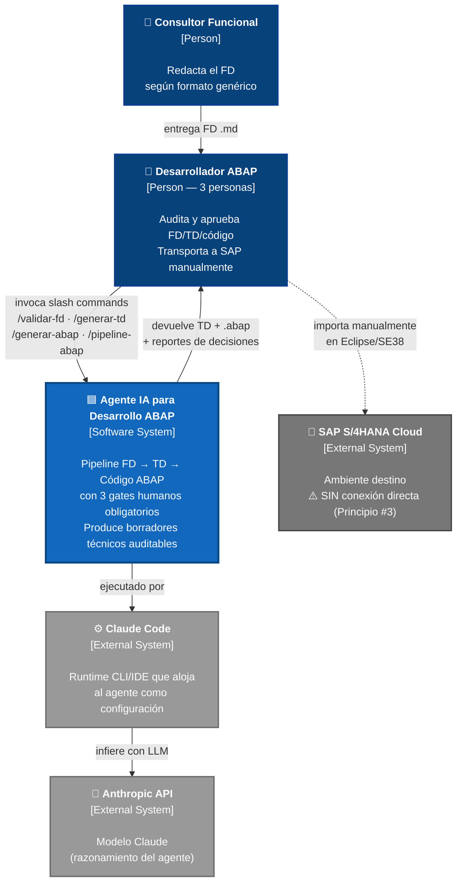
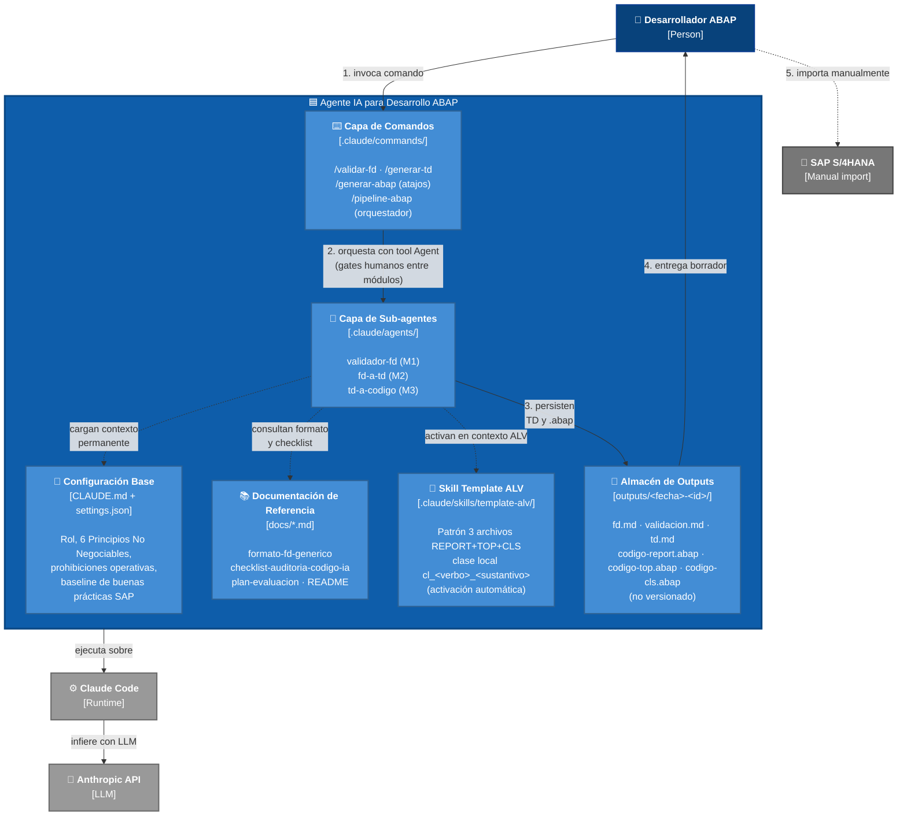

# C4 Model — Agente IA para Desarrollo ABAP

**Fecha**: 2026-05-20
**Versión**: 1.0
**Insumos**: `application-design.md`, `components.md`, PRD §6 (Principios No Negociables), `aidlc-state.md`
**Niveles incluidos**: 1 (System Context) y 2 (Containers)

> Notación: convenciones C4 de Simon Brown (https://c4model.com). Personas en azul oscuro, sistema en foco en azul medio, sistemas externos en gris, containers internos en azul claro. Flechas sólidas = flujo activo; flechas punteadas = carga de contexto / consulta / acción manual fuera del sistema.

---

## Nivel 1 — System Context

Muestra el agente como una caja negra y sus relaciones con personas y sistemas externos.



**Lectura clave**:

- El sistema **no toca SAP**. La línea punteada `Desarrollador → SAP` representa transporte humano manual (Principio #3 del PRD: "El agente opera exclusivamente en el ambiente de desarrollo").
- El **Consultor Funcional** no interactúa directamente con el agente: entrega el FD al desarrollador, que lo carga al pipeline.
- **Claude Code** y **Anthropic API** son dependencias de runtime, no destino de outputs.

---

## Nivel 2 — Containers

Decompone el sistema en sus 6 containers lógicos dentro del repositorio.



**Lectura clave**:

- **6 containers** dentro del sistema. Las flechas sólidas son flujo activo; las punteadas son carga de contexto / consulta / acción manual.
- **`Configuración Base`** es el container más crítico — define los Principios No Negociables que constriñen a todos los sub-agentes (decisión AD3: `settings.json` permisivo + restricciones operativas en `CLAUDE.md`).
- **`Almacén de Outputs`** está dentro del system boundary pero `.gitignore`-d: contiene artefactos por requerimiento que pueden tener información sensible.
- Los pasos numerados (1→5) trazan el happy path del pipeline ejecutado vía `/pipeline-abap`.

---

## Mapeo containers ↔ componentes (`components.md`)

| Container del C4 | Componentes (`components.md`) |
|---|---|
| Configuración Base | C1 (CLAUDE.md), C11 (settings.json) |
| Documentación de Referencia | C7 (formato-fd), C8 (checklist), C9 (plan-evaluación), C10 (README) |
| Capa de Comandos | C5 (/pipeline-abap) + slash commands de C2, C3, C4 |
| Capa de Sub-agentes | C2 (validador-fd), C3 (fd-a-td), C4 (td-a-codigo) |
| Skill Template ALV | C6 |
| Almacén de Outputs | `outputs/<fecha>-<id>/` (generado en runtime) |

---

## Niveles 3 y 4 (no incluidos)

- **Nivel 3 (Component Diagram)**: no aplica directamente. Los "components" del C4 viven dentro de un container desplegable (p. ej., clases dentro de un servicio). En este producto, los containers ya son archivos individuales, por lo que la decomposición útil se detiene en Nivel 2. El detalle equivalente está en `components.md`.
- **Nivel 4 (Code)**: no aplica — el "código" del agente es prompt engineering en Markdown, no código ejecutable estructurable en clases/funciones.

---

## Cómo visualizar este archivo

- **VS Code**: instalá la extensión `Markdown Preview Mermaid Support` (autor `bierner`) → abrí este archivo → `Ctrl+K V` para preview lateral.
- **GitHub**: este archivo se renderiza nativamente al hacer push al repo.
- **Mermaid Live Editor**: copiá un bloque ` ```mermaid ` en https://mermaid.live para export a PNG/SVG.
