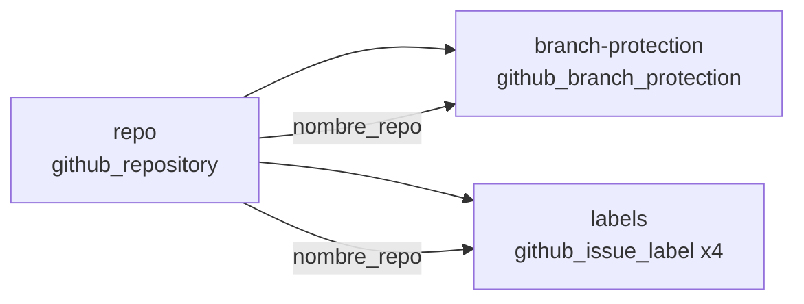
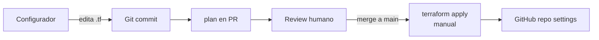

# Arquitectura del Agente IA ABAP — Infraestructura como Código

> **Contrato agente-equipo** para la generación de módulos Terraform.
> Esta spec describe el único activo hospedado del producto: el repositorio de GitHub.
> El producto no requiere infraestructura cloud (ver `entregables/ADR-002-no-iac-cloud.md`).

---

## 1. Descripción del sistema gestionado

El producto se materializa como **configuración de Claude Code** versionada en un repositorio de GitHub (ADR-001). El runtime es local (la máquina del desarrollador). Por tanto, lo único hospedado externamente y susceptible de gestionarse como código es el **repositorio de GitHub** y su configuración asociada:

- Settings generales del repo (descripción, default branch, issues, projects).
- Reglas de protección de la rama `main` (gate de merge — Principio #1 del PRD).
- Sistema de labels (en particular `review-this`, que dispara el AI PR Review advisory).

La spec **no incluye**:

- Compute, storage, networking — el producto no los requiere.
- Workflows de GitHub Actions — ya se versionan como archivos `.yml` bajo `.github/workflows/` y se aplican por presencia, no por `terraform apply`.
- Valores de secrets — referencias y setup manual quedan en `docs/ai-pr-review-human-setup.md`.

---

## 2. Componentes

### 2.1 Repositorio (`github_repository`)

- **Nombre**: `Agente-IA-Desarrollo-ABAP`
- **Visibilidad**: privado
- **Descripción**: "Agente IA para Desarrollo ABAP — pipeline FD → TD → Código basado en Claude Code"
- **Default branch**: `main`
- **Features habilitadas**: issues, projects
- **Features deshabilitadas**: wiki (la documentación vive en el repo bajo `docs/`)
- **Topics**: `claude-code`, `abap`, `ai-agent`, `aidlc`
- **Auto-delete head branches**: `true` (limpieza de ramas post-merge)
- **Allow merge commit**: `false` (preferimos squash para historia lineal)
- **Allow squash merge**: `true`
- **Allow rebase merge**: `false`

### 2.2 Protección de la rama `main` (`github_branch_protection`)

Es el control que materializa el **Principio #1 del PRD** ("el desarrollador es garante final"):

- **Branch pattern**: `main`
- **Required pull request reviews**: 1 reviewer humano
- **Dismiss stale reviews on push**: `true`
- **Require review from code owners**: no aplica (no hay CODEOWNERS en el alcance MVP)
- **Required status checks**:
  - `ai-pr-review` (advisory; el job debe completarse aunque su veredicto no bloquee)
- **Strict (require branches to be up to date)**: `true`
- **Enforce admins**: `true` (nadie salta el gate, ni el Configurador)
- **Allow force pushes**: `false`
- **Allow deletions**: `false`

### 2.3 Labels (`github_issue_label`)

- `review-this` — color `#0E8A16`, descripción "Dispara el AI PR Review advisory en este PR". Es la etiqueta operativa del producto (PRD §AI PR Review).
- `bug` — color `#D73A4A`.
- `enhancement` — color `#A2EEEF`.
- `documentation` — color `#0075CA`.

Los labels estándar de GitHub que no se enumeran aquí no se gestionan por Terraform (drift aceptado para `good first issue`, etc.).

---

## 3. Diagrama de dependencias entre módulos

El módulo `repo` es la fuente; `branch-protection` y `labels` dependen del nombre del repositorio creado.

---

## 4. Flujo operativo

- El `apply` **no está automatizado en CI** (Principio #6 — IA sugiere, humano ejecuta).
- En PR se ejecuta `terraform plan` (manual o vía `validate.sh`) para revisar el diff antes del merge.
- El estado (`terraform.tfstate`) se mantiene **local** durante el piloto. Si el producto escala, se migra a state remoto (S3 + DynamoDB lock) en una segunda iteración — fuera del alcance MVP.

---

## 5. Restricciones de seguridad

- **El `GITHUB_TOKEN` nunca se versiona**. Se pasa por variable de entorno o por archivo `.terraform.tfvars.local` (gitignored).
- El token requiere scopes mínimos: `repo` (full) + `admin:org` (solo si se gestionan settings que lo exijan).
- **No se gestionan secrets del repositorio por Terraform** — los valores quedan fuera del state. La existencia de un secret se documenta en `docs/ai-pr-review-human-setup.md`; su rotación es manual.
- **`enforce_admins = true`** garantiza que ni siquiera el Configurador puede saltar el gate de merge.

---

## 6. Convenciones (steering)

Las convenciones que el agente respeta al generar HCL para este proyecto están en `.claude/skills/iac/SKILL.md`. Resumen:

- **Naming**: recursos en español (`module.repo.principal`, no `module.repo.main`); identificadores HCL en `snake_case`.
- **Tags / topics**: usar `topics` del repo como tagging del producto.
- **Mínimo privilegio**: scopes mínimos del token; nunca `*` en permisos.
- **Sin secrets en código**: ningún valor sensible en `.tf` ni en `.tfvars` versionado.

---

## 7. Entornos

| Entorno | Descripción | Provider config |
|---|---|---|
| `local` | Workstation del Configurador con `GITHUB_TOKEN` en `~/.zshrc`/`~/.bashrc` o `.terraform.tfvars.local` | `provider "github"` con `owner` por variable |
| `ci` *(futuro)* | Ejecución de `plan` en GitHub Actions con token de un GitHub App de la org | Fuera de alcance MVP |

No hay entorno `local` vs `dev` vs `prod` separados porque el activo gestionado es **un solo repositorio**.
