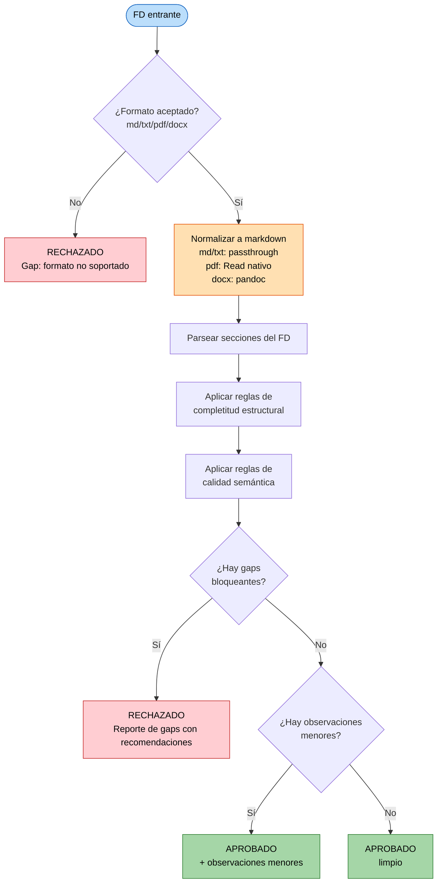

# U2 — Business Logic Model: Validador de FD

**Unidad**: U2 (Módulo 1 del PRD §9)
**Fecha**: 2026-05-19
**Decisiones de diseño aplicadas**: Q1:A (output markdown estructurado), Q2:A (gaps con recomendación accionable), Q3:B revisada por **CR-001** (multi-formato: `.md`, `.txt`, `.pdf`, `.docx` con normalización a markdown).

---

## 1. Propósito del módulo

Compuerta de entrada del pipeline. Recibe un Documento Funcional (FD) y decide si tiene calidad suficiente para alimentar el pipeline. **No** genera TD ni código. **No** permite bypass.

---

## 2. Flujo de validación (algoritmo lógico)



---

## 3. Reglas de completitud estructural (CE)

Aplicadas en orden. Cualquier CE incumplida es gap bloqueante.

| ID | Regla | Verificación |
|---|---|---|
| CE-01 | El FD tiene la sección **Objetivo** no vacía | Buscar encabezado nivel 1 o 2 con "Objetivo"; contenido > 50 caracteres |
| CE-02 | El FD tiene la sección **Alcance** con subdivisión "Dentro del alcance" / "Fuera del alcance" | Buscar encabezado "Alcance"; subdivisión opcional pero contenido enumerable |
| CE-03 | El FD tiene la sección **Reglas de Negocio** con al menos una regla numerada (formato `RN<n>:`) | Buscar encabezado "Reglas de Negocio"; regex `RN\d+:` ≥ 1 |
| CE-04 | El FD tiene la sección **Tablas SAP involucradas** con nombres técnicos | Buscar encabezado "Tablas SAP"; regex de nombres SAP típicos (mayúsculas, longitud 2–10) ≥ 1 |
| CE-05 | El FD tiene la sección **Criterios de Aceptación** con al menos un criterio numerado | Buscar encabezado "Criterios de Aceptación"; regex `CA\d+:` ≥ 1 |
| CE-06 | El FD tiene la sección **Casos Borde** con al menos un caso numerado | Buscar encabezado "Casos Borde"; regex `CB\d+:` ≥ 1 |
| CE-07 | El FD tiene la sección **Autorizaciones** no vacía | Buscar encabezado "Autorizaciones"; contenido > 20 caracteres |

> **Nota**: las verificaciones son **orientativas** — el sub-agente las usa como guía pero ejerce juicio. Un FD con encabezado "Alcance del Requerimiento" en vez de "Alcance" cumple CE-02 si el contenido está. Lo que **no se acepta** es ausencia o vacuidad real.

---

## 4. Reglas de calidad semántica (CS)

Aplicadas sobre el contenido. Pueden generar gap bloqueante (B) u observación menor (O) según severidad.

| ID | Regla | Severidad | Cómo se detecta |
|---|---|---|---|
| CS-01 | Objetivo usa verbos accionables y mide resultado | B si vago | Detectar verbos genéricos ("mejorar", "optimizar") sin objeto/métrica |
| CS-02 | Alcance incluye exclusiones explícitas ("Fuera del alcance") | O | Buscar marca de exclusiones; si falta, observación menor |
| CS-03 | Reglas de Negocio tienen formato condición→acción | B si múltiples reglas son meramente declarativas | Detectar reglas tipo "Validar X" sin decir cómo |
| CS-04 | Tablas SAP nombradas técnicamente (no descriptivamente) | B | Detectar referencias como "tabla de materiales" sin nombre técnico |
| CS-05 | Criterios de Aceptación son verificables | B si múltiples no lo son | Detectar CAs sin umbral medible ("que sea rápido", "que funcione bien") |
| CS-06 | Casos Borde son explícitos, no genéricos | B si todos son "manejar errores" sin enumerar | Detectar CBs sin escenario concreto |
| CS-07 | Autorizaciones nombradas por objeto/rol | B | Detectar referencias como "el que tenga acceso" sin objeto Z*/S* |
| CS-08 | Rango de fechas o filtros temporales sin ambigüedad | O | Detectar referencias a fechas sin especificar "documento" vs "contabilización" |
| CS-09 | Comportamiento ante datos vacíos especificado | O | Si el FD habla de listados/reportes sin decir qué pasa con 0 resultados |

---

## 5. Decisión binaria (regla maestra)

```
SI cualquier CE falla → RECHAZADO
SI cualquier CS con severidad B falla → RECHAZADO
SI todas las CE pasan y todas las CS-B pasan → APROBADO
   y todas las CS-O que fallen se reportan como Observaciones menores
```

---

## 6. Output: estructura del archivo `validacion.md`

### 6.1 Caso APROBADO

```markdown
# Validación de FD — <REQ-id>

## Estado: ✅ APROBADO

## Resumen
Brevísima descripción del FD (1–2 frases) y por qué pasa la validación.

## Observaciones menores (opcional)
- **<sección afectada>** — <descripción del punto observado>. *Recomendación*: <acción sugerida>.
- ...

> El pipeline puede continuar al Módulo 2 (FD → TD).
```

### 6.2 Caso RECHAZADO

```markdown
# Validación de FD — <REQ-id>

## Estado: ❌ RECHAZADO

## Resumen
Breve explicación de por qué se rechaza (1–2 frases).

## Gaps detectados

### Sección 3 — Reglas de Negocio
- **Gap**: Falta especificar el comportamiento cuando la fecha desde queda vacía.
- **Recomendación**: agregar una regla con formato `RN-N: si la fecha desde es vacía, usar fecha actual menos 30 días` o el comportamiento que aplique al caso.

### Sección 7 — Autorizaciones
- **Gap**: No se nombra ningún objeto de autorización ni rol.
- **Recomendación**: indicar el objeto Z*/S* requerido y los roles que lo tienen. Si los datos no son sensibles, declararlo explícitamente: "No requiere AUTHORITY-CHECK adicional al rol estándar de usuario."

(... más gaps agrupados por sección ...)

> El pipeline está detenido. Tras corregir el FD, reenviar al Validador con `/validar-fd`.
```

### 6.3 Persistencia

Cuando el validador se invoca desde `/pipeline-abap` con un `<req-id>`, persiste el output en:

```
outputs/<YYYY-MM-DD>-<req-id>/validacion.md
```

Cuando se invoca standalone con `/validar-fd <ruta-fd>`, imprime en chat únicamente (no persiste salvo que el usuario indique `<req-id>`).

---

## 7. Formatos de entrada aceptados (Q3:B revisada por CR-001)

Tras CR-001 el validador acepta multi-formato y **normaliza a markdown** antes de aplicar las reglas CE/CS. La normalización ocurre en el orquestador del skill `/validar-fd`; el sub-agente validador siempre recibe markdown.

| Extensión | Aceptado | Normalización |
|---|---|---|
| `.md` | ✅ Sí | Passthrough — procesamiento directo |
| `.txt` | ✅ Sí | Passthrough — se interpreta como markdown plano; encabezados detectados por convención (`# `, `## `, etc.) |
| `.pdf` | ✅ Sí | La tool `Read` del sub-agente soporta PDF nativamente (hasta 20 páginas por request). Si el PDF supera 20 páginas, se aborta la validación con aviso al usuario. |
| `.docx` | ✅ Sí | Se convierte a markdown vía `pandoc "<ruta>" -o "<tmp>.md" -t markdown`. Si pandoc no está instalado, se aborta con instrucción al usuario de convertir manualmente. |
| Inline (pegado en chat) | ✅ Sí | El validador acepta texto pegado directamente si no hay ruta de archivo. |
| Otras extensiones | ❌ No | RECHAZADO con gap: "Formato `<ext>` no soportado. Aceptados: `.md`, `.txt`, `.pdf`, `.docx`." |

---

## 8. Lenguaje del reporte (FR-M1-08)

El reporte de gaps NUNCA usa lenguaje acusatorio. Tabla de antes/después:

| ❌ Evitar | ✅ Usar |
|---|---|
| "El consultor olvidó especificar las autorizaciones." | "La sección 'Autorizaciones' no especifica el objeto de autorización requerido." |
| "Esto está mal redactado." | "La sección X podría completarse con <recomendación>." |
| "Faltan datos básicos." | "Para que el pipeline pueda continuar, completar: <lista>." |

---

## 9. Casos especiales documentados

### 9.1 FD inline en el chat
Si el usuario pega un FD directamente en el chat (sin archivo), el validador lo procesa igual. El output sigue siendo markdown estructurado en la respuesta del chat.

### 9.2 FD parcialmente en otro idioma
Si el FD tiene fragmentos en inglés (típico de nombres técnicos SAP), no es gap. Si está predominantemente en inglés, observación menor: "El FD está en inglés; las instrucciones del agente son en español. Confirmar que el equipo puede trabajarlo así."

### 9.3 FD de reverse engineering (UC5 del PRD)
Si el "FD" entregado es código ABAP existente (caso UC5), el validador detecta que no es un FD (no tiene secciones esperables) y devuelve:
> "El input parece ser código ABAP, no un FD. Para documentar objeto legado, usar `/generar-td <ruta-codigo>` directamente que activa el modo reverse engineering del Módulo 2."

---

## 10. No-objetivos explícitos

- ❌ El validador NO **corrige** el FD. Sólo lo evalúa.
- ❌ El validador NO **vuelve a preguntar** al usuario si el FD es ambiguo. Lo rechaza con gap.
- ❌ El validador NO **negocia**: no existe "rechazado pero…". Estado binario.
- ❌ El validador NO **propaga** información al M2. Su output se consume por humanos primero.
