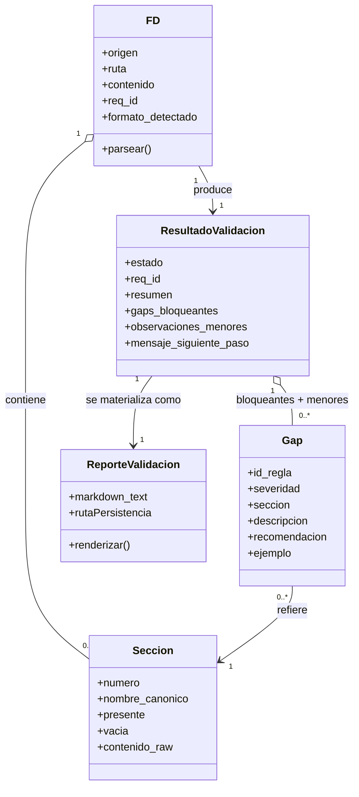

# U2 — Domain Entities: Validador de FD

**Unidad**: U2
**Fecha**: 2026-05-19

Entidades conceptuales del dominio del Validador. **No** son entidades de base de datos (no hay BD). Son **conceptos** que el sub-agente maneja durante la validación. Se materializan como secciones de texto en el output o como variables internas del razonamiento del LLM.

---

## E1 — FD (Documento Funcional)

**Concepto**: el input que recibe el validador.

| Atributo | Tipo | Descripción |
|---|---|---|
| `origen` | enum: `archivo`, `inline` | Si vino como ruta de archivo o pegado en chat |
| `ruta` | string (opcional) | Ruta del archivo si `origen=archivo` |
| `contenido` | texto markdown | El cuerpo del FD |
| `req_id` | string (opcional) | Identificador del requerimiento si fue pasado al comando |
| `formato_detectado` | enum: `md`, `txt`, `desconocido`, `binario`, `no-es-fd` | Detectado en la primera fase del flujo |

**Estados posibles**:
- `recibido` → entra al validador
- `parseado` → secciones identificadas
- `evaluado` → decisión tomada (APROBADO/RECHAZADO)

---

## E2 — Sección del FD

**Concepto**: cada una de las 7 secciones canónicas del formato genérico (§1 de `docs/formato-fd-generico.md`).

| Atributo | Tipo | Descripción |
|---|---|---|
| `numero` | int (1..7) | Número canónico de la sección |
| `nombre_canonico` | string | "Objetivo", "Alcance", "Reglas de Negocio", "Tablas SAP involucradas", "Criterios de Aceptación", "Casos Borde", "Autorizaciones" |
| `presente` | bool | Si fue encontrada en el FD |
| `vacia` | bool | Si está presente pero sin contenido sustantivo |
| `contenido_raw` | texto | El texto crudo de la sección si está presente |

**Relación con E1**: un FD contiene 0..7 secciones (idealmente las 7).

---

## E3 — Gap (incumplimiento)

**Concepto**: una desviación del FD respecto a las reglas de validación.

| Atributo | Tipo | Descripción |
|---|---|---|
| `id_regla` | string | CE-01..07 o CS-01..09 |
| `severidad` | enum: `B`, `O` | Bloqueante u Observación menor |
| `seccion` | string (opcional) | Sección del FD donde se detecta el gap (puede ser null si es transversal) |
| `descripcion` | texto | Descripción del problema en lenguaje no acusatorio |
| `recomendacion` | texto | Acción concreta para cerrar el gap |
| `ejemplo` | texto (opcional) | Ejemplo de la forma correcta |

**Reglas**:
- Severidad `B` → contribuye a RECHAZADO.
- Severidad `O` → contribuye a "observación menor" pero no bloquea APROBADO.

---

## E4 — ResultadoValidacion

**Concepto**: la salida estructurada del validador.

| Atributo | Tipo | Descripción |
|---|---|---|
| `estado` | enum: `APROBADO`, `RECHAZADO` | Decisión binaria |
| `req_id` | string | Identificador del requerimiento (eco del input) |
| `resumen` | texto | 1–2 frases sobre por qué pasa o falla |
| `gaps_bloqueantes` | lista de Gap | Lista no vacía sólo si `estado=RECHAZADO` |
| `observaciones_menores` | lista de Gap | Lista posiblemente no vacía aún si `estado=APROBADO` |
| `mensaje_siguiente_paso` | texto | "El pipeline puede continuar al Módulo 2" o "El pipeline está detenido; corregir el FD y reenviar" |

**Invariantes**:
- Si `estado=APROBADO`, entonces `gaps_bloqueantes` está vacía.
- Si `estado=RECHAZADO`, entonces `gaps_bloqueantes` tiene ≥ 1 elemento.
- `observaciones_menores` puede estar poblada en ambos estados.

---

## E5 — ReporteValidacion (representación markdown)

**Concepto**: la materialización en texto markdown de un `ResultadoValidacion`. Es lo que ve el usuario y lo que se persiste en `validacion.md`.

| Sección | Contenido | Origen |
|---|---|---|
| `# Validación de FD — <req_id>` | Título con req_id | E1.req_id |
| `## Estado: ✅ APROBADO` o `## Estado: ❌ RECHAZADO` | Estado decorado | E4.estado |
| `## Resumen` | Texto del resumen | E4.resumen |
| `## Gaps detectados` (sólo si RECHAZADO) | Sub-secciones por sección del FD, listando Gaps con descripción + recomendación | E4.gaps_bloqueantes agrupados por E3.seccion |
| `## Observaciones menores` (opcional) | Lista de Gaps de severidad O | E4.observaciones_menores |
| `> <mensaje_siguiente_paso>` | Blockquote final | E4.mensaje_siguiente_paso |

---

## Diagrama de relaciones

---

## Notas de implementación

- Estas entidades **no** se modelan como clases o estructuras de datos en código — el sub-agente `validador-fd` razona sobre ellas como conceptos.
- El "parseo" del FD ocurre dentro del modelo (LLM). No hay parser explícito en código.
- El "output estructurado" se produce siguiendo el template de `business-logic-model.md` §6.
- Sin persistencia de "validaciones anteriores" — el validador es **stateless** (BR-14).
