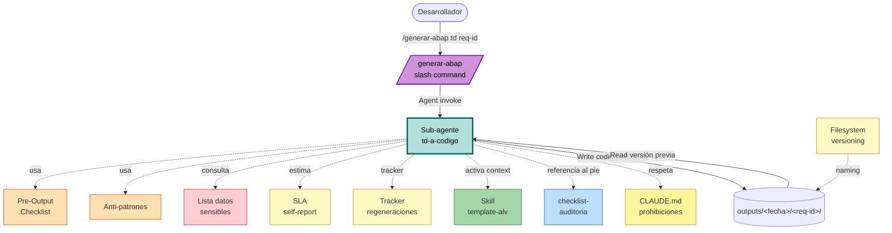

# U4 — Logical Components

**Unidad**: U4
**Fecha**: 2026-05-20

Componentes lógicos que soportan los NFRs de U4. En su mayoría son **secciones específicas de archivos de configuración** (el system prompt del sub-agente), no servicios desplegables.

---

## 1. Inventario

| Componente | Tipo | Ubicación | Soporta NFRs |
|---|---|---|---|
| LC1 — Sub-agente `td-a-codigo` | System prompt | `.claude/agents/td-a-codigo.md` | NFR-U4-SEC-01..04, NFR-U4-MAINT-01..04, NFR-U4-QUAL-01..03, NFR-U4-USAB-01..02 |
| LC2 — Slash command `/generar-abap` | Slash command | `.claude/commands/generar-abap.md` | NFR-U4-USAB-02, persistencia |
| LC3 — Sección Pre-Output Checklist (dentro del sub-agente) | Sub-sección del system prompt | LC1, sección específica | NFR-U4-SEC-01..03, NFR-U4-QUAL-01..02 (Q1:B) |
| LC4 — Sección Anti-Patrones (dentro del sub-agente) | Sub-sección del system prompt | LC1, sección específica | NFR-U4-SEC-04, NFR-U4-MAINT |
| LC5 — Lista ampliada de datos sensibles | Sub-sección del system prompt | LC1, sección específica | NFR-U4-SEC-01 (Q1:B) |
| LC6 — Heurística de SLA self-reported | Lógica embebida en el sub-agente | LC1, comportamiento | NFR-U4-PERF-01 (Q2:B) |
| LC7 — Tracker de regeneraciones (BR-12 escalation) | Lógica embebida en el sub-agente + el slash command | LC1 + LC2 | NFR-U4-REL-02 |
| LC8 — Filesystem versioning (`codigo-vN.abap`) | Convención de naming en `Write` | LC1 (sub-agente persiste), LC2 (slash command verifica) | NFR-U4-REL-02 (regeneración trazada) |
| LC9 — Skill `template-alv` (referencia, no implementación U4) | Skill activable | `.claude/skills/template-alv/` (U6) | NFR-U4-QUAL-01 cuando aplica ALV |
| LC10 — Documento checklist auditoría | Documento referencia | `docs/checklist-auditoria-codigo-ia.md` (creado en U1) | NFR-U4-USAB-01 (referenciado al pie del `.abap`) |
| LC11 — Documento CLAUDE.md prohibiciones | Documento referencia | `CLAUDE.md` §3 (creado en U1) | NFR-U4-SEC-04 (Document-Side Permission Compensation) |

---

## 2. Detalle de cada componente

### LC1 — Sub-agente `td-a-codigo`

**Tipo**: archivo `.claude/agents/td-a-codigo.md` con frontmatter + system prompt.

**Composición esperada** (a generar en U4 Code Generation):
- Frontmatter: `name`, `description`, `tools: Read, Glob, Grep, Write`.
- System prompt en español con secciones:
  - §1 Rol y entradas.
  - §2 Flujo principal (12 pasos).
  - §3 Verificación de §8 del TD (BR-01).
  - §4 Zonas de riesgo y `⚠️ VERIFICAR:`.
  - §5 Estructura del archivo `.abap` con template literal (Q2:C, Q5:A).
  - §6 Aplicación de buenas prácticas (referencia a CLAUDE.md §5).
  - §7 Skill ALV con fallback (Q4:B).
  - §8 Persistencia y versionado.
  - §9 Ciclo de retroalimentación + límite 2 ciclos.
  - §10 Sin generación de tests + recordatorio.
  - **§11 Pre-Output Checklist (LC3)** — secuencia explícita.
  - **§12 Lista ampliada de datos sensibles (LC5)** — tablas a proteger con AUTHORITY-CHECK.
  - §13 BR-01..16.
  - **§14 Anti-patrones (LC4)** — qué NO hacer.
  - §15 Heurística SLA self-reported (LC6).

**Responsabilidad operativa**: producir un `ArchivoABAP` (entidad E2 de domain-entities) que satisface todos los NFR-U4-*.

---

### LC2 — Slash command `/generar-abap`

**Tipo**: archivo `.claude/commands/generar-abap.md` con frontmatter + prompt.

**Responsabilidades**:
- Parsear `<ruta-td> [req-id]`.
- Validar existencia del TD.
- Crear directorio `outputs/<fecha>/<req-id>/` si hay `req-id`.
- Invocar al sub-agente con tool `Agent`.
- Imprimir el `.abap` resultante en chat.
- Persistir como backup si el sub-agente no lo hizo.
- Resumen final con próximos pasos (syntax check, pruebas unitarias, checklist).

---

### LC3 — Pre-Output Checklist (Q1:B)

**Tipo**: sub-sección del system prompt del sub-agente (LC1 §11).

**Implementa**: el patrón **Pre-Output Auto-Checklist** de `nfr-design-patterns.md` §2.

**Lista de 10 checks** (replicada de `nfr-design-patterns.md` §2 para referencia):
1. Sin `SELECT *`.
2. `FOR ALL ENTRIES` con guarda.
3. `AUTHORITY-CHECK` en accesos a tablas de LC5 + verificación `SY-SUBRC`.
4. Sin SQL dinámico inseguro.
5. Sin literales con PII aparente.
6. Sin comentarios con datos reales.
7. Cabecera de 4 bloques completa.
8. Pie con referencia al checklist auditoría.
9. Pie con recordatorio de tests pendientes.
10. Comentarios en español.

---

### LC4 — Anti-patrones (sección §14 del sub-agente)

**Tipo**: sub-sección del system prompt.

**Contenido** (a incluir en LC1):
- ❌ No generar código que llame `TR_INSERT_REQUEST_WITH_TASKS` u otros FMs de transporte.
- ❌ No incluir credenciales SAP hardcoded.
- ❌ No usar `OPEN DATASET` sin justificación documentada en §8 del TD.
- ❌ No incluir RFCs salvo que el TD lo declare explícitamente.
- ❌ No generar tests unitarios (Q3:A).
- ❌ No saltarse la cabecera de 4 bloques.
- ❌ No saltarse el pie con referencia al checklist.
- ❌ No inventar nombres de FMs/BAdIs/tablas.
- ❌ No procesar TD sin §8 (BR-01).
- ❌ No intentar una 3a regeneración con el mismo tipo de error (BR-12).

---

### LC5 — Lista ampliada de datos sensibles (Q1:B)

**Tipo**: sub-sección del system prompt (LC1 §12).

**Lista canónica** (replicada de `nfr-requirements.md` §NFR-U4-SEC-01):

```markdown
### Dominios sensibles que requieren AUTHORITY-CHECK obligatorio

| Categoría | Tablas típicas | Severidad |
|---|---|---|
| Nómina | PA0008, PA0014, PA0015, PA2001, PA2002 | Crítica |
| RRHH | PA0001, PA0002, PA0006, HRP1000, HRP1001 | Crítica |
| Finanzas/Contabilidad | BSEG, BKPF, BSID, BSAD, BSIK, BSAK | Alta |
| PII | KNA1 (NAME1/STRAS/TELF1/EMAIL), LFA1 (idem), ADRC | Alta |
| Clientes/Crédito | KNB1, KNVV, KNKK, KNVK | Media |
| Proveedores | LFB1, LFM1, LFC1 | Media |
| Márgenes/Costos | KONP, KONV, KOMP, EKKO con valoración, MBEW | Media |

Si el código accede a una tabla de esta lista, inserta AUTHORITY-CHECK + IF sy-subrc <> 0 antes del SELECT/INSERT/UPDATE/DELETE.
Si el objeto de autorización no fue declarado en el TD, infiérelo y marca con ⚠️ VERIFICAR.
```

---

### LC6 — Heurística SLA self-reported (Q2:B)

**Tipo**: lógica embebida en el system prompt del sub-agente.

**Comportamiento**:
- Si el TD entrante tiene > N indicadores de complejidad (longitud > 5KB, > 5 tablas listadas, > 10 RNs, > 5 TBDs, > 3 objetos SAP no estándar), el sub-agente estima que la generación habrá tomado > 5 min.
- En ese caso, agrega en cabecera "Decisiones del código" una nota explícita (texto canónico en `nfr-design-patterns.md` §6).

**Decisión registrada**: estimación basada en heurísticas de complejidad del input, no en medición de wall-clock time.

---

### LC7 — Tracker de regeneraciones

**Tipo**: lógica distribuida entre LC1 (sub-agente) y LC2 (slash command).

**Estado tracked**:
- `intento_numero`: 1, 2, 3...
- `tipo_error_previo`: hash/categorización del último error reportado.

**Implementación**:
- El slash command pasa al sub-agente el contexto de la regeneración (qué versión es, qué error reportó el usuario).
- El sub-agente compara con la entrada anterior. Si `intento_numero == 3` y los errores son del mismo tipo → emite escalamiento (BR-12).
- Sin estado persistente — todo viene del filesystem (`Read outputs/<fecha>/<req-id>/codigo-v(N-1).abap`).

---

### LC8 — Filesystem versioning

**Tipo**: convención de naming aplicada en la tool `Write`.

**Patrón**:
- Primer output: `outputs/<fecha>/<req-id>/codigo.abap`.
- 1ª regeneración: `outputs/<fecha>/<req-id>/codigo-v2.abap`.
- 2ª regeneración: `outputs/<fecha>/<req-id>/codigo-v3.abap`.
- Versiones anteriores NUNCA se sobreescriben (incluso si se trabaja en el mismo `<req-id>`).

---

### LC9 — Skill `template-alv` (referencia externa)

**Tipo**: skill desarrollado en U6 (todavía no construido cuando se está diseñando U4).

**Cómo lo consume U4**:
- Activación automática por Claude Code basado en `description` del skill.
- Fallback explícito: `Read .claude/skills/template-alv/SKILL.md` cuando el output sale genérico.
- Si no existe (U6 no construida aún), aplica patrón base y declara en cabecera.

---

### LC10 — `docs/checklist-auditoria-codigo-ia.md`

**Tipo**: documento markdown ya creado en U1.

**Cómo lo consume U4**:
- El sub-agente NO lee el contenido en cada generación (sería overhead).
- El sub-agente REFERENCIA la ruta del checklist en el pie del `.abap` generado, recordando la responsabilidad del desarrollador.

---

### LC11 — `CLAUDE.md` §3 (prohibiciones)

**Tipo**: documento markdown ya creado en U1.

**Cómo lo consume U4**:
- Claude Code carga CLAUDE.md automáticamente al iniciar sesión.
- El sub-agente referencia §3 en su §3 (Prohibiciones explícitas).
- Cuando el usuario pide algo prohibido, el sub-agente cita CLAUDE.md § correspondiente.

---

## 3. Diagrama de interacción



---

## 4. Verificación de soporte de NFRs

| NFR | Soportado por |
|---|---|
| NFR-U4-SEC-01 (AUTHORITY-CHECK datos sensibles) | LC3 check 3 + LC5 lista + LC1 prompt |
| NFR-U4-SEC-02 (SQL seguro) | LC3 checks 1, 2, 4 |
| NFR-U4-SEC-03 (sin PII) | LC3 checks 5, 6 |
| NFR-U4-SEC-04 (sin transporte/SAP write) | LC4 anti-patrones + LC11 CLAUDE.md |
| NFR-U4-PERF-01 (SLA ≤5 min self-report) | LC6 heurística |
| NFR-U4-PERF-02 (≤2h humanas) | Heredado del pipeline — sin componente específico en U4 |
| NFR-U4-REL-01 (≥80% compilable) | Medido en evaluación pre-piloto (`docs/plan-evaluacion.md`) |
| NFR-U4-REL-02 (escalamiento BR-12) | LC7 tracker |
| NFR-U4-MAINT-01..04 (convenciones, responsabilidad única, métodos cortos, español) | LC1 prompt + LC11 CLAUDE.md §5 |
| NFR-U4-QUAL-01 (compilabilidad) | LC3 implícito (correcto SQL, naming, etc.) + verificación humana post-output |
| NFR-U4-QUAL-02 (sin advertencias críticas ATC) | LC10 checklist auditoría humana |
| NFR-U4-QUAL-03 (sin métricas formales) | N/A — decisión Q2:A |
| NFR-U4-USAB-01 (output legible) | LC1 estructura del prompt + LC2 imprime en chat |
| NFR-U4-USAB-02 (mensajes accionables) | LC1 mensajes canónicos en BR-01, BR-12; LC2 resumen final |
