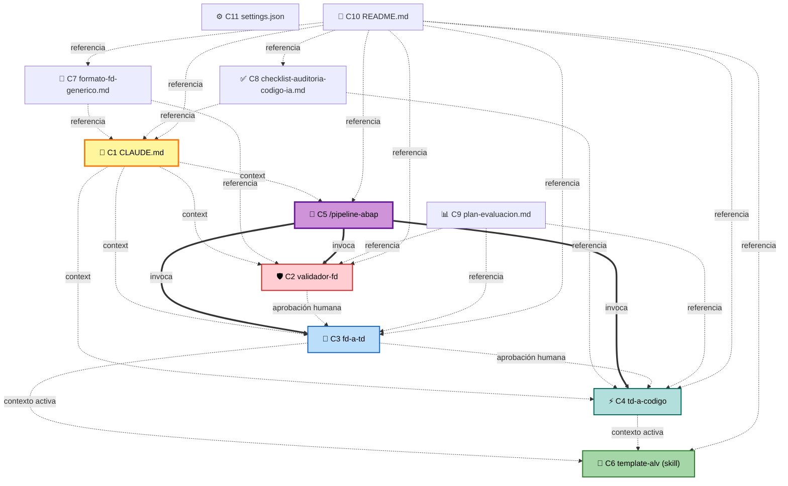

# Component Dependency — Grafo y patrones de comunicación

**Fecha**: 2026-05-19

---

## Matriz de dependencias

> **Lectura**: fila `X` depende de columna `Y` si la celda está marcada.

| ↓ depende de → | C1 | C2 | C3 | C4 | C5 | C6 | C7 | C8 | C9 | C10 | C11 |
|---|---|---|---|---|---|---|---|---|---|---|---|
| **C1** CLAUDE.md | — | — | — | — | — | — | ref | ref | — | — | — |
| **C2** Validador FD | ✅ ctx | — | — | — | — | — | ✅ ref | — | — | — | — |
| **C3** FD→TD | ✅ ctx | aprob | — | — | — | act | ✅ ref | — | — | — | — |
| **C4** TD→Código | ✅ ctx | — | aprob | — | — | act | — | ✅ ref | — | — | — |
| **C5** Orquestador | ✅ ctx | ✅ inv | ✅ inv | ✅ inv | — | — | — | ✅ ref | — | — | — |
| **C6** Skill ALV | — | — | — | — | — | — | — | — | — | — | — |
| **C7** Formato FD | — | — | — | — | — | — | — | — | — | — | — |
| **C8** Checklist | — | — | — | — | — | — | — | — | — | — | — |
| **C9** Plan evaluación | ref | ref | ref | ref | ref | — | ref | ref | — | — | — |
| **C10** README | ref | ref | ref | ref | ref | ref | ref | ref | ref | — | ref |
| **C11** settings.json | — | — | — | — | — | — | — | — | — | — | — |

**Leyenda**:
- `ctx`: depende del contexto permanente (CLAUDE.md cargado por Claude Code).
- `aprob`: depende de la aprobación humana del output del componente anterior (gate).
- `inv`: invoca al componente con la tool `Agent`.
- `act`: el componente activa el skill por contexto.
- `ref`: lo referencia documentalmente.

---

## Grafo de dependencias (visual)

---

## Patrones de comunicación

### Patrón 1 — Contexto compartido vía CLAUDE.md
- Claude Code carga `CLAUDE.md` (C1) automáticamente al abrir el directorio.
- Todos los sub-agentes y comandos (C2..C5) heredan ese contexto sin necesidad de pasarlo explícitamente.
- Trade-off: si C1 crece demasiado, consume contexto en cada interacción. Hay que mantenerlo conciso.

### Patrón 2 — Invocación con tool `Agent`
- C5 (orquestador) invoca a C2/C3/C4 usando `Agent(subagent_type="<nombre>", prompt="<contexto>")`.
- Cada invocación corre en su propio contexto aislado: el orquestador recibe sólo el resultado (`message`), no el log interno del sub-agente.
- Trade-off: garantiza contexto limpio pero **el orquestador no ve lo intermedio** — si el sub-agente toma una decisión cuestionable internamente, el orquestador sólo ve el resultado final.

### Patrón 3 — Activación de skill por contexto
- C6 (Skill template-alv) tiene un `description` en su frontmatter que el modelo evalúa contra el contexto activo.
- Cuando C3/C4 trabajan sobre un ALV, el modelo activa C6 automáticamente.
- Trade-off: activación es "best-effort"; si el FD no menciona explícitamente "ALV" (sólo "reporte de stock"), el skill puede no activarse. Mitigación: el sub-agente decide explícitamente y puede solicitar el skill por nombre si lo necesita.

### Patrón 4 — Persistencia en sistema de archivos
- C3 escribe `td.md` en `outputs/<fecha>-<id>/`.
- C4 lee `td.md` (si invocado standalone) o recibe TD inline (si invocado por C5).
- Trade-off: archivo en disco habilita trazabilidad histórica y reproducción; inline reduce I/O y latencia. Q2:C combina ambos.

### Patrón 5 — Gate humano explícito entre invocaciones
- C5 nunca encadena dos invocaciones (`Agent(...)` → `Agent(...)`) sin pausa intermedia.
- Cada pausa pregunta al usuario en chat y espera respuesta explícita.
- Trade-off: aumenta el tiempo total (no hay autopilot), pero respeta los Principios #1 y #6 del PRD.

---

## Orden de inicialización y consumo

1. **Inicialización (al abrir directorio en Claude Code)**:
   - Claude Code lee `C11` (settings.json) y `C1` (CLAUDE.md).
   - Los sub-agentes (C2/C3/C4) y comandos (incluido C5) quedan disponibles para invocación.
   - El skill C6 queda registrado para activación contextual.

2. **Consumo en una sesión típica (UC1 — pipeline completo)**:
   1. Desarrollador ejecuta `/pipeline-abap docs/ejemplos/fd-retal.md REQ-2026-042`.
   2. C5 lee el FD, invoca C2 (Agent). C1, C7 ya están en contexto.
   3. C2 retorna `APROBADO`. C5 pregunta al desarrollador si continuar.
   4. C5 invoca C3 con el FD. C6 (skill) se activa por contexto si el FD habla de ALV.
   5. C3 genera TD, persiste en `outputs/`, retorna. C5 muestra inline y pregunta.
   6. C5 invoca C4 con el TD. C6 sigue activo si era ALV.
   7. C4 genera `.abap`, persiste, retorna. C5 muestra inline y referencia C8.
   8. Sesión termina. Desarrollador toma el `.abap` para syntax check y pruebas.

3. **Consumo standalone (UC5 — objeto legado)**:
   - Desarrollador ejecuta `/generar-td <ruta-código-existente>` directamente.
   - C3 detecta input no es FD y aplica modo "reverse engineering" (documentado en CLAUDE.md).

---

## Riesgos de acoplamiento y mitigaciones

| Riesgo | Mitigación |
|---|---|
| C1 crece y consume contexto excesivo | Mantener C1 conciso (<300 líneas); extraer estándares verbosos a documentos referenciados. |
| Cambios en C7 (formato FD) requieren rehacer C2 | C2 referencia C7 dinámicamente ("lee `docs/formato-fd-generico.md`"); no embebe el formato. |
| Skill C6 activación no determinística | El sub-agente puede invocar `Read("docs/skills-context.md")` como fallback si detecta ALV en texto pero el skill no se activó solo. |
| El orquestador no ve decisiones internas de los sub-agentes | Los sub-agentes deben siempre exponer "Decisiones y Supuestos" (FR-M2-06, FR-M3-06) en su output — esa sección hace visible lo que de otro modo sería caja negra. |
