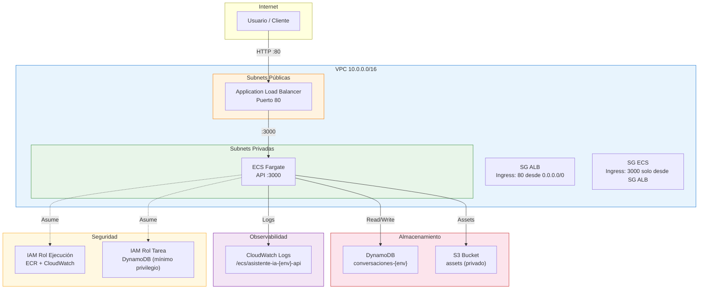
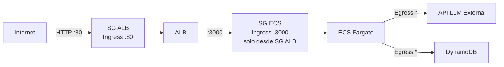
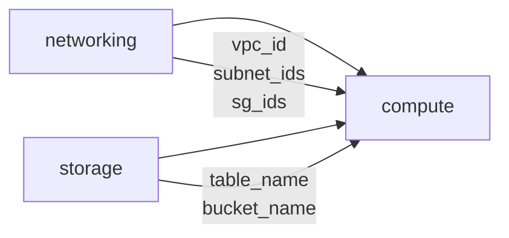

# iac-infra — Infraestructura como Código para Asistente IA

Infraestructura AWS desplegable tanto en **LocalStack** (desarrollo local) como en **AWS real** (dev/prod), usando un único codebase de Terraform.

## Estructura del proyecto

```
iac-infra/
├── docker-compose.yml                 # LocalStack (emulador AWS local)
├── package.json                       # Scripts npm para ciclo de vida Terraform
├── infra/
│   ├── provider.tf                    # Provider AWS dual (LocalStack / AWS real)
│   ├── main.tf                        # Orquestación de módulos
│   ├── variables.tf                   # Variables raíz
│   ├── outputs.tf                     # Outputs raíz
│   ├── providers-local.tfvars         # Variables para LocalStack
│   ├── providers-aws.tfvars           # Variables para AWS real
│   └── modules/
│       ├── networking/                # VPC, subnets, IGW, SGs
│       │   ├── main.tf
│       │   ├── variables.tf
│       │   └── outputs.tf
│       ├── compute/                   # ECS Fargate, ALB, IAM, CloudWatch
│       │   ├── main.tf
│       │   ├── variables.tf
│       │   └── outputs.tf
│       └── storage/                   # DynamoDB, S3
│           ├── main.tf
│           ├── variables.tf
│           └── outputs.tf
├── scripts/
│   └── validate.sh                    # Validación de infraestructura y drift
└── specs/
    └── architecture.md                # Especificación arquitectónica
```

## Diagrama de arquitectura



## Flujo de red



## Diagrama de dependencias entre módulos



## Prerrequisitos

- **Terraform** >= 1.5
- **Docker** (para LocalStack)
- **AWS CLI** / **awslocal** (para validación)
- **Node.js** (para scripts npm)

## Comandos del ciclo de vida

### 1. Iniciar LocalStack

```bash
docker compose up -d
```

### 2. Inicializar Terraform

```bash
cd infra
terraform init
```

### 3. Plan — Previsualizar cambios

**LocalStack:**
```bash
terraform plan -var-file=providers-local.tfvars
```

**AWS real:**
```bash
terraform plan -var-file=providers-aws.tfvars
```

### 4. Apply — Crear/actualizar infraestructura

**LocalStack:**
```bash
terraform apply -var-file=providers-local.tfvars -auto-approve
```

**AWS real:**
```bash
terraform apply -var-file=providers-aws.tfvars
```

### 5. Output — Ver valores de salida

```bash
terraform output
```

Outputs disponibles:
| Output | Descripción |
|--------|-------------|
| `url_api` | DNS público del ALB |
| `nombre_cluster_ecs` | Nombre del cluster ECS |
| `nombre_tabla_conversaciones` | Nombre de la tabla DynamoDB |
| `nombre_bucket_assets` | Nombre del bucket S3 |
| `logs_del_api` | Nombre del log group de CloudWatch |

### 6. Destroy — Eliminar infraestructura

**LocalStack:**
```bash
terraform destroy -var-file=providers-local.tfvars -auto-approve
```

**AWS real:**
```bash
terraform destroy -var-file=providers-aws.tfvars
```

### 7. Validar infraestructura

```bash
# LocalStack
bash ../scripts/validate.sh

# AWS real
bash ../scripts/validate.sh aws
```

### Scripts npm (alternativa)

```bash
npm run infra:init              # terraform init
npm run infra:plan:local        # plan contra LocalStack
npm run infra:plan:aws          # plan contra AWS real
npm run infra:apply:local       # apply en LocalStack
npm run infra:apply:aws         # apply en AWS real
npm run infra:destroy:local     # destroy en LocalStack
npm run infra:destroy:aws       # destroy en AWS real
npm run infra:output            # ver outputs
npm run validate                # validar en LocalStack
npm run validate:aws            # validar en AWS real
```

## Variables de configuración

| Variable | Default | Descripción |
|----------|---------|-------------|
| `proyecto` | `asistente-ia` | Nombre del proyecto (prefijo de recursos) |
| `environment` | `dev` | Entorno: `local`, `dev`, `prod` |
| `aws_region` | `us-east-1` | Región AWS |
| `localstack_endpoint` | `""` | Endpoint LocalStack (`http://localhost:4566`) |
| `imagen_contenedor` | — | URI de la imagen ECR |
| `tareas_deseadas` | `2` | Número de tareas ECS |

### Diferencias por entorno

| Configuración | LocalStack | AWS real |
|---------------|-----------|----------|
| `localstack_endpoint` | `http://localhost:4566` | `""` (vacío) |
| `aws_access_key` | `test` | `""` (usa perfil CLI) |
| `aws_secret_key` | `test` | `""` (usa perfil CLI) |
| `environment` | `local` | `dev` / `prod` |
| `tareas_deseadas` | `1` | `2` |

## Operaciones comunes

### Ver drift de infraestructura

```bash
terraform plan -var-file=providers-local.tfvars -detailed-exitcode
# Exit 0 = sin cambios, Exit 2 = hay drift
```

### Importar un recurso existente al state

```bash
terraform import -var-file=providers-local.tfvars \
  module.storage.aws_dynamodb_table.conversaciones conversaciones-local
```

### Refrescar state sin aplicar cambios

```bash
terraform refresh -var-file=providers-local.tfvars
```

### Formatear y validar código HCL

```bash
terraform fmt -recursive    # Formatear archivos .tf
terraform validate          # Validar sintaxis y configuración
```

### Listar y consultar recursos en el state

```bash
terraform state list                     # Listar todos los recursos
terraform state show module.storage.aws_dynamodb_table.conversaciones  # Detalle
```

### Mover un recurso en el state (refactor)

```bash
terraform state mv module.old_name.aws_resource.name module.new_name.aws_resource.name
```

## Convenciones

- **Naming:** `{proyecto}-{environment}-{componente}` (ej: `asistente-ia-local-vpc`)
- **Tags obligatorios:** `Proyecto`, `Environment`, `ManagedBy=terraform`
- **Seguridad:** mínimo privilegio en IAM, ECS sin IP pública, S3 con Block Public Access
- **Idioma:** recursos y variables en español
